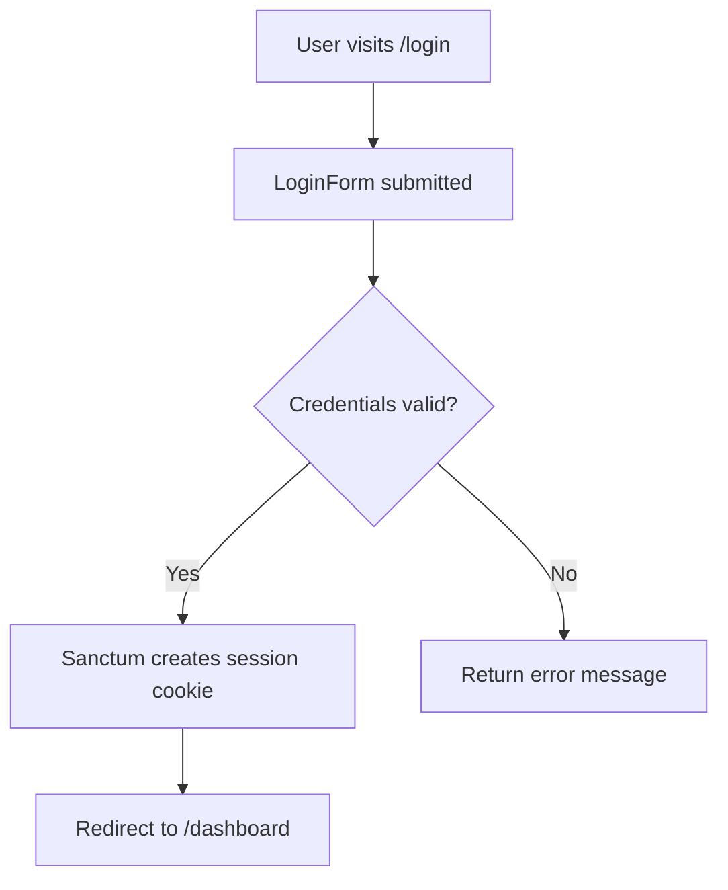

# Piano di Sviluppo MVP - CorpVitals24

**Generato da**: Artiforge  
**Data**: 25 Ottobre 2025  
**Task**: Implementare le funzionalità core dell'MVP

---

## Riepilogo

Questo piano copre 9 step fondamentali per costruire le funzionalità core dell'MVP di CorpVitals24:

1. **Frontend Scaffolding** - Vue 3 + Inertia + Tailwind + Pinia
2. **Autenticazione Backend** - Sanctum + Spatie Permission
3. **Routes e Controller Auth** - Login/Logout con Inertia
4. **Database Seeders** - Dati di test per teams, users, KPI
5. **Dashboard** - Controller, Service e View
6. **Pinia Stores** - State management centralizzato
7. **Security Hardening** - Headers, rate limiting, cookies sicuri
8. **Documentazione** - README, guide, diagrammi
9. **CI/CD** - GitHub Actions per linting e test

---

## Step 1: Initialize Frontend Scaffolding

### Obiettivo
Configurare Vue 3 + Inertia.js con Tailwind CSS, Headless UI e Pinia per l'SPA.

### Reasoning
Tutte le funzionalità UI successive (login, dashboard, componenti KPI) dipendono da un corretto setup dello stack Inertia-Vue. Configurare Tailwind e Headless UI ora garantisce aderenza alle regole di accessibilità e stile UI.

### Implementazione

1. **Installare pacchetti npm**:
```bash
npm i @inertiajs/inertia @inertiajs/inertia-vue3 @inertiajs/vue3 \
  vue@3.4 tailwindcss@3 postcss autoprefixer \
  @headlessui/vue @heroicons/vue pinia@2 \
  vue-i18n@9 vee-validate@4 @vee-validate/zod zod@3
```

2. **Configurare Tailwind**:
```bash
npx tailwindcss init -p
```
Modificare `tailwind.config.cjs` per includere `resources/**/*.blade.php` e `resources/js/**/*.vue`.

3. **Configurare Vite** (`vite.config.js`):
```js
import { defineConfig } from 'vite';
import vue from '@vitejs/plugin-vue';
import laravel from 'laravel-vite-plugin';

export default defineConfig({
  plugins: [
    vue(),
    laravel({
      input: ['resources/css/app.css', 'resources/js/app.js'],
      refresh: true,
    }),
  ],
});
```

4. **Setup app.css** con Tailwind:
```css
@tailwind base;
@tailwind components;
@tailwind utilities;
```

5. **Creare Layout base** (`resources/js/Pages/Layout.vue`):
```vue
<template>
  <div id="app">
    <Head :title="title" />
    <slot />
  </div>
</template>
```

6. **Registrare Pinia** in `resources/js/app.js`:
```js
import { createApp, h } from 'vue';
import { createInertiaApp } from '@inertiajs/vue3';
import { createPinia } from 'pinia';
import { resolvePageComponent } from 'laravel-vite-plugin/inertia-helpers';

createInertiaApp({
  resolve: name => resolvePageComponent(`./Pages/${name}.vue`, import.meta.glob('./Pages/**/*.vue')),
  setup({ el, App, props, plugin }) {
    const pinia = createPinia();
    createApp({ render: () => h(App, props) })
      .use(plugin)
      .use(pinia)
      .mount(el);
  },
});
```

7. **Aggiornare welcome.blade.php** per caricare Vite assets e root Inertia.

### Gestione Errori
- **Vite compilation fails**: Verificare Node ≥ 18 e integrazione Laravel/Vite
- **Tailwind purge errors**: Verificare paths in `tailwind.config.cjs`

### Testing
1. `npm run dev` e verificare che la welcome page carichi senza errori console
2. Verificare HTML contiene classi Tailwind (es. `bg-gray-100`)
3. Test Cypress per presenza `<div id="app">`

---

## Step 2: Configure Sanctum & Spatie Permission

### Obiettivo
Configurare autenticazione SPA con Sanctum e RBAC multi-tenant con Spatie.

### Reasoning
Sanctum fornisce autenticazione cookie-based compatibile con Inertia, mentre Spatie gestisce ruoli e permessi per tenant. Entrambi sono obbligatori per login e controllo accessi dashboard.

### Implementazione

1. **Pubblicare assets Sanctum**:
```bash
php artisan vendor:publish --provider="Laravel\Sanctum\SanctumServiceProvider"
php artisan migrate
```

2. **Configurare Sanctum** (`config/sanctum.php`):
```php
'stateful' => explode(',', env('SANCTUM_STATEFUL_DOMAINS', 'localhost,127.0.0.1')),
```

3. **Aggiungere middleware** in `app/Http/Kernel.php`:
```php
\Laravel\Sanctum\Http\Middleware\EnsureFrontendRequestsAreStateful::class
```

4. **Installare Spatie Permission**:
```bash
composer require spatie/laravel-permission
php artisan vendor:publish --provider="Spatie\Permission\PermissionServiceProvider"
php artisan migrate
```

5. **Aggiornare User model**:
```php
use Spatie\Permission\Traits\HasRoles;

class User extends Authenticatable
{
    use HasRoles;
    // ...
}
```

6. **Creare TeamPolicy** per scope permessi al tenant

7. **Middleware EnsureUserHasTeam** per verificare appartenenza al team

8. **Aggiornare guard** in `config/auth.php`:
```php
'guards' => [
    'web' => [
        'driver' => 'session',
        'provider' => 'users',
    ],
    'sanctum' => [
        'driver' => 'sanctum',
        'provider' => 'users',
    ],
],
```

### Gestione Errori
- **CSRF mismatch**: Assicurarsi che `X-XSRF-TOKEN` sia inviato con richieste Inertia
- **Permission checks failing**: Verificare ruolo super-admin abbia permessi `*`

### Testing
1. Feature test `SanctumLoginTest.php` che verifica login e cookie di sessione
2. Test che user senza permesso `view-dashboard` riceve 403
3. Test Pest per accesso dashboard non autenticato:
```php
it('prevents unauthenticated access to dashboard', function () {
    $this->get('/dashboard')->assertRedirect('/login');
});
```

---

## Step 3: Authentication Routes & Controllers

### Obiettivo
Implementare routes, controller e FormRequests per login/logout con risposte Inertia.

### Reasoning
Endpoints dedicati e richieste validate garantiscono sicurezza e aderenza alle code rules (FormRequest, controller sottili).

### Implementazione

1. **Routes** in `routes/web.php`:
```php
Route::group(['middleware' => ['guest']], function () {
    Route::get('/login', fn () => Inertia::render('Auth/Login'))->name('login');
    Route::post('/login', [LoginController::class, 'store']);
});

Route::post('/logout', [LogoutController::class, 'destroy'])
     ->middleware('auth:sanctum')
     ->name('logout');
```

2. **LoginRequest** (`app/Http/Requests/LoginRequest.php`):
```php
public function rules(): array {
    return [
        'email' => ['required','email'],
        'password' => ['required','string'],
        'remember' => ['sometimes','boolean'],
    ];
}
```

3. **LoginController**:
```php
<?php
namespace App\Http\Controllers\Auth;

use App\Http\Controllers\Controller;
use App\Http\Requests\LoginRequest;
use Illuminate\Support\Facades\Auth;
use Inertia\Inertia;

class LoginController extends Controller
{
    public function store(LoginRequest $request)
    {
        $credentials = $request->only('email', 'password');
        $remember = $request->boolean('remember');

        if (!Auth::attempt($credentials, $remember)) {
            return back()->withErrors(['email' => __('auth.failed')]);
        }

        $request->session()->regenerate();

        return redirect()->intended('/');
    }
}
```

4. **LogoutController**:
```php
public function destroy(Request $request)
{
    Auth::guard('web')->logout();
    $request->session()->invalidate();
    $request->session()->regenerateToken();
    
    return redirect('/login');
}
```

5. **Vue Login Page** (`resources/js/Pages/Auth/Login.vue`):
```vue
<script setup lang="ts">
import { useForm } from '@inertiajs/vue3';
import { z } from 'zod';

const schema = z.object({
  email: z.string().email(),
  password: z.string().min(6),
  remember: z.boolean().optional(),
});

const form = useForm({
  email: '',
  password: '',
  remember: false,
});

const submit = () => {
  form.post('/login');
};
</script>

<template>
  <div class="min-h-screen flex items-center justify-center bg-gray-100">
    <!-- Form con Headless UI e Tailwind AA contrast -->
  </div>
</template>
```

### Gestione Errori
- **Credenziali errate**: Errore localizzato su campo `email`
- **Session fixation**: Rigenerare session ID dopo login (già fatto)
- **CSRF**: `useForm` di Inertia gestisce automaticamente

### Testing
1. Unit test `LoginRequest` con data provider
2. Feature test login successo con redirect e cookie Sanctum
3. Cypress test messaggi validazione su campi vuoti

---

## Step 4: Database Seeders

### Obiettivo
Creare seeders per popolare teams, companies, users, roles, permissions, periods e KPI.

### Reasoning
Dati realistici permettono demo MVP significative e base per test automatici.

### Implementazione

1. **RolesTableSeeder** (espandere esistente):
```php
$admin = Role::create(['name' => 'admin']);
$admin->givePermissionTo(Permission::all());

$manager = Role::create(['name' => 'manager']);
$manager->givePermissionTo(['view-dashboard', 'import-data']);

$viewer = Role::create(['name' => 'viewer']);
$viewer->givePermissionTo(['view-dashboard']);
```

2. **TeamSeeder**:
```php
Team::factory()->count(3)->create()->each(function ($team) {
    $company = Company::factory()->create(['team_id' => $team->id]);
    
    User::factory()->admin()->create(['team_id' => $team->id, 'company_id' => $company->id]);
    User::factory()->count(2)->manager()->create(['team_id' => $team->id, 'company_id' => $company->id]);
    User::factory()->count(5)->viewer()->create(['team_id' => $team->id, 'company_id' => $company->id]);
});
```

3. **Factories** (se non esistenti):
- `TeamFactory`
- `CompanyFactory`
- `UserFactory` (con stati `admin`, `manager`, `viewer`)
- `PeriodFactory`
- `KpiFactory`
- `KpiValueFactory`

4. **PeriodSeeder**: Generare ultimi 12 mesi di periodi

5. **KpiSeeder**: 10 KPI core (Revenue, EBITDA, Gross Margin, ecc.) con metadata JSONB

6. **KpiValueSeeder**: Valori NUMERIC random per ogni KPI per company/period

7. **DatabaseSeeder** (ordine):
```php
$this->call([
    RolesTableSeeder::class,
    TeamSeeder::class,
    PeriodSeeder::class,
    KpiSeeder::class,
    KpiValueSeeder::class,
]);
```

8. Eseguire: `php artisan db:seed`

### Gestione Errori
- **Foreign-key violations**: Rispettare ordine creazione (team → company → user → period → kpi → kpi_value)
- **Duplicate roles**: Usare `firstOrCreate` in role seeder

### Testing
1. PHPUnit test `DatabaseSeederTest` che verifica conteggi record
2. Pest con `uses(DatabaseMigrations::class)` per reset DB

---

## Step 5: Dashboard Implementation

### Obiettivo
Creare route, controller e view Dashboard che mostra KPI card e placeholder per charts.

### Reasoning
Dashboard è UI core dell'MVP. Controller deve restare sottile, delegando a service.

### Implementazione

1. **Route** in `routes/web.php`:
```php
Route::get('/dashboard', [DashboardController::class, 'index'])
     ->middleware(['auth:sanctum', 'verified', 'ensure.team']);
```

2. **DashboardController**:
```php
<?php
namespace App\Http\Controllers;

use App\Services\DashboardService;
use Inertia\Inertia;

class DashboardController extends Controller
{
    public function __construct(private DashboardService $service) {}

    public function index()
    {
        $summary = $this->service->getDashboardSummary(auth()->user());
        return Inertia::render('Dashboard/Index', ['summary' => $summary]);
    }
}
```

3. **DashboardService**:
```php
class DashboardService
{
    public function __construct(private KpiRepositoryInterface $kpiRepo) {}
    
    public function getDashboardSummary(User $user): array
    {
        $cacheKey = "dashboard:{$user->id}:{$period->id}";
        
        return Cache::remember($cacheKey, 300, function () use ($user) {
            // Logica di aggregazione KPI
            return [
                'kpis' => $this->kpiRepo->getLatestKpiValuesForCompany($user->company_id),
                // ...
            ];
        });
    }
}
```

4. **KpiRepositoryInterface**: Metodo `getLatestKpiValuesForCompany(int $companyId, int $periodId)`

5. **Dashboard Vue Page** (`resources/js/Pages/Dashboard/Index.vue`):
```vue
<script setup lang="ts">
import { defineAsyncComponent } from 'vue';
import type { DashboardSummary } from '@/types/dashboard';

defineProps<{
  summary: DashboardSummary;
}>();

const ECharts = defineAsyncComponent(() => import('../../components/EChartsWrapper.vue'));
const RevoGrid = defineAsyncComponent(() => import('../../components/RevoGridWrapper.vue'));
</script>

<template>
  <div class="container mx-auto p-6">
    <div class="grid grid-cols-1 md:grid-cols-3 gap-4">
      <KpiCard v-for="kpi in summary.kpis" :key="kpi.id" :kpi="kpi" />
    </div>
    
    <Suspense>
      <template #default>
        <ECharts :data="summary.chartData" />
      </template>
      <template #fallback>
        <div>Caricamento...</div>
      </template>
    </Suspense>
  </div>
</template>
```

6. **KpiCard Component** con Headless UI e ARIA

7. **Pinia store** `dashboard.ts` per stato e azioni refresh

### Gestione Errori
- **ModelNotFoundException**: Catch in controller, mostrare pagina errore Inertia
- **Cache miss**: Fallback a DB query, catch errori Redis

### Testing
1. Unit test `DashboardService::getDashboardSummary` con mock repository
2. Feature test accesso `/dashboard` con permesso `view-dashboard`
3. Cypress test rendering KPI cards e focus outline

---

## Step 6: Pinia Stores Setup

### Obiettivo
Configurare store Pinia per auth e dashboard, integrazione con shared data Inertia.

### Reasoning
Store centralizzati semplificano state management, evitano prop-drilling.

### Implementazione

1. **Auth Store** (`resources/js/stores/auth.ts`):
```ts
import { defineStore } from 'pinia';

interface User {
  id: number;
  name: string;
  email: string;
  roles: string[];
}

export const useAuthStore = defineStore('auth', {
  state: () => ({
    user: null as User | null,
  }),
  getters: {
    isAuthenticated: (state) => !!state.user,
    hasRole: (state) => (role: string) => state.user?.roles.includes(role) ?? false,
  },
  actions: {
    async fetchUser() {
      const { data } = await axios.get('/api/user');
      this.user = data;
    },
    async logout() {
      await axios.post('/logout');
      this.user = null;
    },
  },
});
```

2. **Dashboard Store** (`resources/js/stores/dashboard.ts`):
```ts
import { defineStore } from 'pinia';
import type { DashboardSummary } from '@/types/dashboard';

export const useDashboardStore = defineStore('dashboard', {
  state: () => ({
    summary: null as DashboardSummary | null,
  }),
  actions: {
    setSummary(payload: DashboardSummary) {
      this.summary = payload;
    },
  },
});
```

3. **Inertia shared data** in `app.js`:
```ts
import { router } from '@inertiajs/vue3';

router.on('navigate', () => {
  const auth = useAuthStore();
  if (!auth.user) {
    auth.fetchUser();
  }
});
```

4. **HandleInertiaRequests middleware**: Aggiungere `auth.user` e `session.flash` a shared props

### Gestione Errori
- **API 401**: Redirect a login
- **Network failures**: Toast notification, mantieni stato precedente

### Testing
1. Unit test Pinia store con Vitest, mock axios
2. E2E test auth store contiene user corretto dopo login

---

## Step 7: Security Hardening

### Obiettivo
Applicare security headers, rate limiting, cookies sicuri.

### Reasoning
Compliance con misure di sicurezza prima di esporre MVP a utenti esterni.

### Implementazione

1. **CORS** con `fruitcake/laravel-cors` in `config/cors.php`

2. **TrustProxies** middleware:
```php
protected $proxies = '*';
protected $headers = Request::HEADER_X_FORWARDED_ALL;
```

3. **SecureHeaders middleware**:
```php
public function handle($request, Closure $next)
{
    $response = $next($request);
    $response->headers->set('X-Content-Type-Options', 'nosniff');
    $response->headers->set('X-Frame-Options', 'DENY');
    $response->headers->set('Referrer-Policy', 'strict-origin-when-cross-origin');
    $response->headers->set('Permissions-Policy', 'geolocation=()');
    $response->headers->set('Content-Security-Policy', "default-src 'self'; script-src 'self' 'unsafe-inline'; style-src 'self' 'unsafe-inline';");
    return $response;
}
```

4. **Cookie settings** in `.env`:
```
SESSION_SECURE_COOKIE=true
SESSION_SAME_SITE=strict
SESSION_HTTP_ONLY=true
```

5. **Rate limiting**:
```php
RateLimiter::for('api', function (Request $request) {
    return Limit::perMinute(60)->by(optional($request->user())->id ?: $request->ip());
});
```

### Gestione Errori
- **CSP blocking Vue**: Aggiustare `'unsafe-inline'` per Vite
- **Rate limiting in CI**: Limiti più alti per CI IP

### Testing
1. Pest test per presenza security headers
2. Test rate limiting con >60 chiamate/minuto, expect 429

---

## Step 8: Documentation Updates

### Obiettivo
Aggiornare README, guide setup, diagrammi auth flow, descrizione seed data.

### Reasoning
Documentazione chiara accelera onboarding nuovi sviluppatori.

### Implementazione

1. **README.md** con sezioni:
   - Prerequisites (PHP 8.4, Node 20, PostgreSQL 16, Redis)
   - Installation (`composer install`, `npm install`, `.env`)
   - Dev server (`php artisan serve` + `npm run dev`)
   - Seed database (`php artisan db:seed`)

2. **documenti/FRONTEND_SETUP.md**: Vite, Inertia, Tailwind, Pinia

3. **documenti/AUTH_FLOW.md** con diagramma Mermaid:


4. **DATABASE_DESIGN.md**: Aggiornare con tabelle seeded e cardinalità

5. **Markdown style guide**: Header hierarchy, code fences

### Gestione Errori
- **Broken links**: Link checker prima di commit

### Testing
1. CI step `markdownlint-cli` su `.md` files
2. Verificare README su GitHub Pages

---

## Step 9: CI/CD Pipeline

### Obiettivo
Configurare GitHub Actions per linting, coding standards e test PHP/TypeScript.

### Reasoning
Code rules richiedono PSR-12, ESLint/Prettier, Conventional Commits; CI deve bloccare violazioni.

### Implementazione

1. **GitHub Actions** (`.github/workflows/ci.yml`):
```yaml
name: CI

on:
  push:
    branches: [ main, develop ]
  pull_request:
    branches: [ main, develop ]

jobs:
  php:
    runs-on: ubuntu-latest
    steps:
      - uses: actions/checkout@v4
      - uses: shivammathur/setup-php@v2
        with:
          php-version: '8.4'
          extensions: pgsql, redis
      - run: composer install --prefer-dist
      - run: vendor/bin/php-cs-fixer fix --dry-run --diff
      - run: vendor/bin/pest --coverage
      
  node:
    runs-on: ubuntu-latest
    steps:
      - uses: actions/checkout@v4
      - uses: actions/setup-node@v4
        with:
          node-version: '20'
      - run: npm ci
      - run: npx eslint . --ext .ts,.vue
      - run: npx prettier --check .
      - run: npm run build
      
  commitlint:
    runs-on: ubuntu-latest
    steps:
      - uses: actions/checkout@v4
      - uses: wagoid/commitlint-github-action@v5
```

2. **Composer**: `php-cs-fixer` e `pestphp/pest` come dev dependencies

3. **ESLint config** (`.eslintrc.cjs`):
```js
module.exports = {
  extends: ['eslint:recommended', 'plugin:vue/vue3-recommended'],
  parserOptions: {
    project: './tsconfig.json',
  },
};
```

4. **tsconfig.json**:
```json
{
  "compilerOptions": {
    "strict": true,
    "paths": {
      "@/*": ["resources/js/*"]
    }
  }
}
```

5. **Husky hooks**:
   - `pre-commit`: `npm run lint && npm run test:unit`
   - `commit-msg`: `npx commitlint -E HUSKY_GIT_PARAMS`

### Gestione Errori
- **Missing env vars**: `.env.example` con defaults per CI

### Testing
1. Workflow manuale per verificare tutti i job passano
2. Intentionally break rule e verificare CI fail

---

## Riepilogo Step

| Step | Descrizione | Tempo Stimato |
|------|-------------|---------------|
| 1 | Frontend Scaffolding | 2-3 ore |
| 2 | Sanctum & Spatie | 1-2 ore |
| 3 | Auth Routes & Controllers | 2-3 ore |
| 4 | Database Seeders | 2-3 ore |
| 5 | Dashboard Implementation | 3-4 ore |
| 6 | Pinia Stores | 1-2 ore |
| 7 | Security Hardening | 1-2 ore |
| 8 | Documentation | 1-2 ore |
| 9 | CI/CD Pipeline | 1-2 ore |

**Totale stimato**: 14-23 ore

---

## Note Finali

- Seguire sempre le regole in `<steps_rules>`
- Chiedere conferma utente prima di ogni step
- Usare `act-as-agent` tool dopo conferma
- Aggiornare documentazione durante lo sviluppo
- Testare ogni funzionalità prima di procedere

