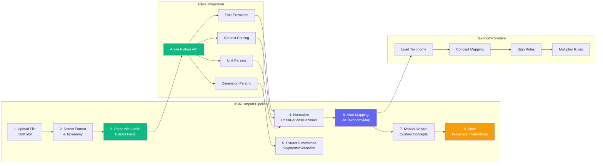
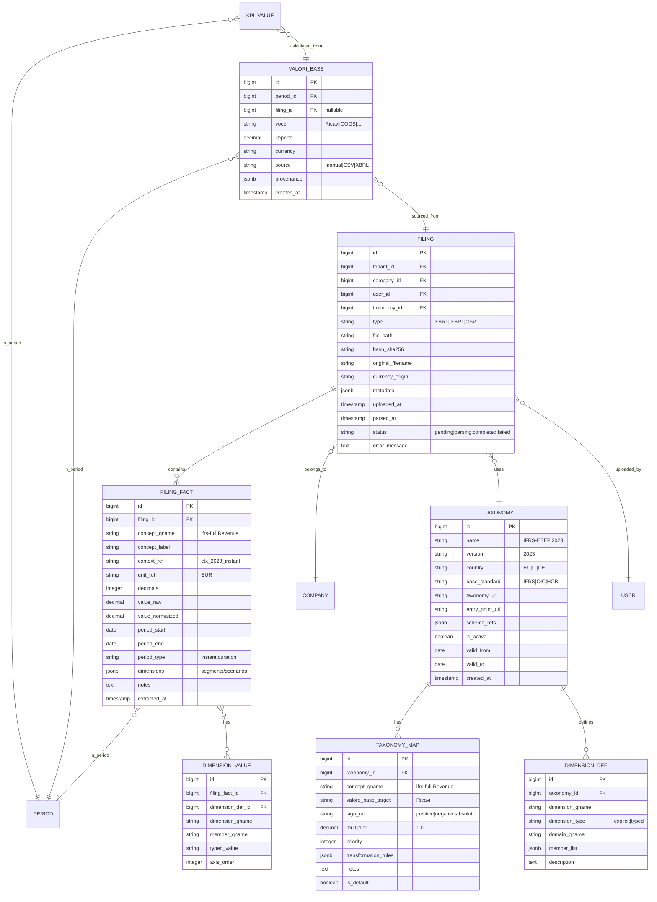
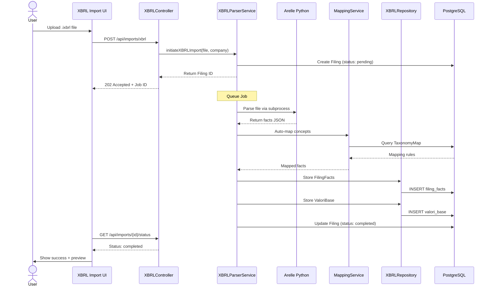

# Piano di Sviluppo Post-MVP con XBRL/iXBRL - CorpVitals24

**Versione**: 2.0 (XBRL Integrated)  
**Data Creazione**: 27 Ottobre 2025  
**Stato**: In Attesa di Esecuzione  
**Obiettivo**: Sviluppo completo dalla fase MVP verso v1.0 con supporto nativo XBRL/iXBRL

---

## 🎯 Novità Versione 2.0

### ✨ Differenze rispetto a v1.0
- **+6 step XBRL** dedicati (parsing, tassonomie, dimensioni)
- **Arelle Python** integrato come parser robusto
- **Tassonomie** IFRS/ESEF + Italian OIC/InfoCamere
- **Gestione dimensioni** XBRL complete (segments, scenarios, typed/explicit)
- **Dataset acquisizione** file ESEF + OIC reali per testing
- **Timeline**: 9-11 settimane (vs 7-8 originali)

### 📊 Impatto Business
- **Differenziatore competitivo**: Poche piattaforme PMI supportano XBRL nativo
- **Compliance UE**: Pronto per Direttiva 2013/34/UE e ESEF
- **Target espanso**: CSV + bilanci ufficiali depositati
- **Tracciabilità completa**: From XBRL fact → ValoriBase → KPI

---

## 📋 Struttura Piano (24 Step)

### 🏗️ **FASE 1: Fondamenta e Database** (Settimane 1-2)
- **Step 1**: Design architetturale high-level con XBRL
- **Step 2A**: Estensioni data model CSV/XLSX (import base)
- **Step 2B**: ✨ Tabelle XBRL complete (Filing, FilingFact, Taxonomy, TaxonomyMap)
- **Step 2C**: ✨ Acquisizione dataset XBRL e seed tassonomie

### 📥 **FASE 2A: Import CSV/XLSX** (Settimane 3-4)
- **Step 3A**: Backend import CSV (controller, service, job)
- **Step 4A**: Frontend Import CSV UI (wizard mapping)

### 🔷 **FASE 2B: Import XBRL/iXBRL** (Settimane 5-7) ✨ NUOVO
- **Step 3B**: ✨ Integrazione Arelle Python parser
- **Step 3C**: ✨ XBRL Service (parsing, normalizzazione, auto-mapping)
- **Step 3D**: ✨ Gestione dimensioni XBRL (segments, scenarios, typed/explicit)
- **Step 4B**: ✨ Frontend Import XBRL UI (upload, preview facts)
- **Step 4C**: ✨ Wizard mapping XBRL avanzato (dimensioni + custom concepts)
- **Step 4D**: ✨ Taxonomy Management UI (CRUD + versioning)

### 🧮 **FASE 3: KPI Engine** (Settimana 8)
- **Step 5**: KPI Engine con supporto multi-source (FilingFact + raw_rows)
- **Step 6**: API endpoints KPI

### 📊 **FASE 4: Visualizzazione** (Settimane 9-10)
- **Step 7**: Componenti Vue per grafici (ECharts)
- **Step 8**: Integrazione RevoGrid
- **Step 9**: Assemblaggio Dashboard completa

### 📄 **FASE 5: Report ed Export** (Settimana 10)
- **Step 10**: Generazione PDF con Browsershot
- **Step 11**: Export CSV/XLSX

### 👥 **FASE 6: Multi-Company e Sicurezza** (Settimana 11)
- **Step 12**: Gestione multi-company completa
- **Step 13**: Security hardening avanzato

### 🔍 **FASE 7: Osservabilità** (Settimana 11)
- **Step 14**: Osservabilità completa (OpenTelemetry + Prometheus)

### 📚 **FASE 8: Finalizzazione** (Settimane 11-12)
- **Step 15**: Aggiornamento documentazione completa
- **Step 16**: Suite test completa (>80% coverage)
- **Step 17**: Deploy Docker e monitoring stack

---

## 🏗️ Architettura Completa con XBRL

```mermaid
graph TB
    subgraph "Frontend Layer"
        UI[Vue 3 SPA]
        ImportCSV[CSV Import Wizard]
        ImportXBRL[XBRL Import Wizard]
        Dashboard[Dashboard]
        Charts[ECharts]
        Grid[RevoGrid]
    end
    
    subgraph "API/Controller Layer"
        ImportCtrl[ImportController]
        XBRLCtrl[XBRLImportController]
        KpiCtrl[KpiController]
        DashCtrl[DashboardController]
        ReportCtrl[ReportController]
        TaxonomyCtrl[TaxonomyController]
    end
    
    subgraph "Application Services"
        CSVImportSvc[CSVImportService]
        XBRLParseSvc[XBRLParserService]
        XBRLMapSvc[XBRLMappingService]
        DimSvc[DimensionService]
        KpiEngineSvc[KPIEngineService]
        DashSvc[DashboardService]
        ReportSvc[ReportService]
    end
    
    subgraph "Queue Jobs"
        CSVJob[ProcessCSVImportJob]
        XBRLJob[ProcessXBRLImportJob]
        CalcJob[CalculateKpiJob]
        ReportJob[GenerateReportJob]
    end
    
    subgraph "External Tools"
        Arelle[Arelle Python<br/>XBRL Parser]
        Browsershot[Browsershot<br/>PDF Generator]
    end
    
    subgraph "Data Layer"
        ImportRepo[ImportRepository]
        XBRLRepo[XBRLRepository]
        TaxonomyRepo[TaxonomyRepository]
        KpiRepo[KPIRepository]
        FinRepo[FinancialDataRepository]
    end
    
    subgraph "Database PostgreSQL 16"
        Tables[("Tables")]
        Filing[(Filing)]
        FilingFact[(FilingFact)]
        Taxonomy[(Taxonomy)]
        TaxonomyMap[(TaxonomyMap)]
        ValoriBase[(ValoriBase)]
        KpiValue[(KpiValue)]
        RawRows[(raw_rows)]
    end
    
    subgraph "Cache & Storage"
        Redis[(Redis Cache)]
        FileStorage[File Storage<br/>S3/Local]
    end
    
    UI --> ImportCSV
    UI --> ImportXBRL
    UI --> Dashboard
    
    ImportCSV --> ImportCtrl
    ImportXBRL --> XBRLCtrl
    Dashboard --> DashCtrl
    Dashboard --> KpiCtrl
    
    ImportCtrl --> CSVImportSvc
    XBRLCtrl --> XBRLParseSvc
    XBRLCtrl --> XBRLMapSvc
    XBRLCtrl --> DimSvc
    KpiCtrl --> KpiEngineSvc
    DashCtrl --> DashSvc
    
    CSVImportSvc --> CSVJob
    XBRLParseSvc --> XBRLJob
    KpiEngineSvc --> CalcJob
    
    XBRLJob --> Arelle
    XBRLJob --> XBRLMapSvc
    XBRLMapSvc --> DimSvc
    ReportSvc --> Browsershot
    
    CSVJob --> ImportRepo
    XBRLJob --> XBRLRepo
    XBRLMapSvc --> TaxonomyRepo
    KpiEngineSvc --> KpiRepo
    KpiEngineSvc --> FinRepo
    
    ImportRepo --> RawRows
    XBRLRepo --> Filing
    XBRLRepo --> FilingFact
    TaxonomyRepo --> Taxonomy
    TaxonomyRepo --> TaxonomyMap
    FinRepo --> ValoriBase
    KpiRepo --> KpiValue
    
    XBRLMapSvc --> Redis
    KpiRepo --> Redis
    XBRLJob --> FileStorage
    ReportSvc --> FileStorage
    
    style ImportXBRL fill:#6366F1,color:#fff
    style XBRLCtrl fill:#6366F1,color:#fff
    style XBRLParseSvc fill:#6366F1,color:#fff
    style Arelle fill:#10B981,color:#fff
    style Filing fill:#F59E0B,color:#fff
    style FilingFact fill:#F59E0B,color:#fff
```



---

## 📐 Architettura XBRL Dettagliata



---

## 🗄️ Database Schema XBRL Completo



---

# 📋 STEP DETTAGLIATI

---

## Step 1: Design Architetturale High-Level con XBRL

### Azione
Progettare l'architettura completa includendo XBRL/iXBRL come fonte primaria di import insieme a CSV/XLSX.

### Ragionamento
L'integrazione XBRL richiede componenti aggiuntivi (parser, normalizzatore, dimension handler) che devono coesistere con il flusso CSV esistente, mantenendo separazione dei concern e riusabilità.

### Dettagli di Implementazione

#### ADR da Creare
1. **ADR-001**: Scelta Arelle Python come parser XBRL
   - **Context**: Necessità di parsing robusto ESEF iXBRL e XBRL 2.1
   - **Decision**: Usare Arelle via subprocess PHP
   - **Consequences**: Dipendenza Python, ma massima compatibilità
   - **Alternatives considered**: lyquidity/xbrl (PHP nativo, meno maturo)

2. **ADR-002**: Approccio dual-source per import (CSV + XBRL)
   - **Context**: Due flussi di import paralleli con destinazione comune (ValoriBase)
   - **Decision**: Service layer unificato con strategy pattern per fonte
   - **Consequences**: Code reuse, testabilità, facile aggiunta fonti future

3. **ADR-003**: Gestione dimensioni XBRL con tabella dedicata
   - **Context**: Dimensioni XBRL (explicit/typed) necessarie per drill-down
   - **Decision**: Tabella `dimension_values` normalizzata
   - **Consequences**: Query complesse, ma flessibilità massima

4. **ADR-004**: Caching tassonomie in Redis
   - **Context**: Taxonomy loading è costoso
   - **Decision**: Cache in-memory con TTL 24h
   - **Consequences**: Performance migliorata, invalidazione su update taxonomy

#### Diagrammi Mermaid
- ✅ Architettura completa (già creato sopra)
- ✅ XBRL Pipeline dettagliata (già creato sopra)
- ✅ Database schema ER (già creato sopra)

#### Component Interaction Sequence



#### File da Creare
- `documenti/ADRs/adr-001-arelle-parser.md`
- `documenti/ADRs/adr-002-dual-source-import.md`
- `documenti/ADRs/adr-003-xbrl-dimensions-storage.md`
- `documenti/ADRs/adr-004-taxonomy-caching.md`
- `documenti/ARCHITECTURE.md` (aggiornato con sezione XBRL)
- `documenti/XBRL_INTEGRATION_GUIDE.md` (nuovo)

### Gestione Errori
- Documentare pattern retry per chiamate Arelle (timeout, file corrotti)
- Strategia fallback per tassonomie non riconosciute

### Testing
- Review ADR con team/peer
- Validare sequence diagram con casi d'uso reali

### Tip 💡
Usa PlantUML o Mermaid Live Editor per validare diagrammi prima del commit. Considera tool come Structurizr per documentare architettura in modo versionato.

---

## Step 2A: Estensioni Data Model CSV/XLSX

### Azione
Definire estensioni data model per import CSV/XLSX (come da piano originale).

### Dettagli di Implementazione
- Tabelle: `imports`, `import_mappings`, `raw_rows`, `kpi_calculation_logs`
- Schema snake_case, indici GIN su JSONB
- Migration con up/down sicuri

### Gestione Errori
Test su database sandbox prima di production.

### Testing
```bash
php artisan migrate:fresh
php artisan db:seed --class=ImportTestSeeder
```

### Tip 💡
Considera partizionamento `raw_rows` per `import_id` se file >50k righe.

---

## Step 2B: ✨ Tabelle XBRL Complete

### Azione
Creare schema database completo per supportare XBRL/iXBRL con tassonomie, facts, dimensioni e mapping.

### Ragionamento
Le tabelle XBRL devono catturare tutta la semantica del formato: concepts, contexts, units, dimensioni, e permettere tracciabilità completa da fact originale a KPI finale.

### Dettagli di Implementazione

#### Migration 1: `create_filings_table`
```php
Schema::create('filings', function (Blueprint $table) {
    $table->id();
    $table->foreignId('tenant_id')->constrained()->cascadeOnDelete();
    $table->foreignId('company_id')->constrained()->cascadeOnDelete();
    $table->foreignId('user_id')->constrained()->cascadeOnDelete();
    $table->foreignId('taxonomy_id')->nullable()->constrained()->nullOnDelete();
    
    $table->enum('type', ['CSV', 'XLSX', 'XBRL', 'iXBRL']);
    $table->string('file_path');
    $table->string('hash_sha256', 64)->unique();
    $table->string('original_filename');
    $table->string('currency_origin', 3)->default('EUR');
    
    $table->jsonb('metadata')->nullable(); // mime_type, size, encoding, etc.
    
    $table->timestamp('uploaded_at')->useCurrent();
    $table->timestamp('parsed_at')->nullable();
    
    $table->enum('status', ['pending', 'parsing', 'completed', 'failed'])->default('pending');
    $table->text('error_message')->nullable();
    
    $table->timestamps();
    $table->softDeletes();
    
    // Indexes
    $table->index(['company_id', 'status', 'created_at']);
    $table->index(['tenant_id', 'type']);
    $table->index('hash_sha256');
});
```

#### Migration 2: `create_filing_facts_table`
```php
Schema::create('filing_facts', function (Blueprint $table) {
    $table->id();
    $table->foreignId('filing_id')->constrained()->cascadeOnDelete();
    
    // XBRL Concept
    $table->string('concept_qname'); // es. "ifrs-full:Revenue"
    $table->string('concept_label')->nullable(); // Human-readable label
    
    // XBRL Context
    $table->string('context_ref'); // es. "ctx_2023_duration"
    $table->date('period_start')->nullable();
    $table->date('period_end')->nullable();
    $table->enum('period_type', ['instant', 'duration'])->default('duration');
    
    // XBRL Unit
    $table->string('unit_ref')->nullable(); // es. "EUR"
    $table->integer('decimals')->nullable(); // Precision
    
    // Values
    $table->decimal('value_raw', 20, 6); // Original value
    $table->decimal('value_normalized', 20, 6)->nullable(); // After decimals/sign normalization
    
    // Dimensions (stored as JSONB for flexibility)
    $table->jsonb('dimensions')->nullable(); // {segment: {...}, scenario: {...}}
    
    $table->text('notes')->nullable();
    $table->timestamp('extracted_at')->useCurrent();
    $table->timestamps();
    
    // Indexes
    $table->index(['filing_id', 'concept_qname']);
    $table->index(['filing_id', 'period_start', 'period_end']);
    $table->index('context_ref');
    
    // GIN index for JSONB dimensions
    $table->rawIndex('dimensions', 'filing_facts_dimensions_gin', 'gin');
});
```

#### Migration 3: `create_taxonomies_table`
```php
Schema::create('taxonomies', function (Blueprint $table) {
    $table->id();
    
    $table->string('name'); // "IFRS-ESEF 2023"
    $table->string('version'); // "2023"
    $table->string('country', 2)->nullable(); // "EU", "IT", "DE"
    $table->enum('base_standard', ['IFRS', 'OIC', 'HGB', 'PCGR', 'Other']);
    
    $table->text('taxonomy_url')->nullable(); // URL to taxonomy package
    $table->text('entry_point_url')->nullable(); // Main schema URL
    $table->jsonb('schema_refs')->nullable(); // List of included schemas
    
    $table->boolean('is_active')->default(true);
    $table->date('valid_from')->nullable();
    $table->date('valid_to')->nullable();
    
    $table->timestamps();
    
    // Indexes
    $table->index(['country', 'base_standard', 'is_active']);
    $table->unique(['name', 'version']);
});
```

#### Migration 4: `create_taxonomy_maps_table`
```php
Schema::create('taxonomy_maps', function (Blueprint $table) {
    $table->id();
    $table->foreignId('taxonomy_id')->constrained()->cascadeOnDelete();
    
    $table->string('concept_qname'); // "ifrs-full:Revenue"
    $table->string('valore_base_target'); // "Ricavi"
    
    $table->enum('sign_rule', ['positive', 'negative', 'absolute', 'preserve'])->default('preserve');
    $table->decimal('multiplier', 10, 6)->default(1.0);
    $table->integer('priority')->default(100); // For conflict resolution
    
    $table->jsonb('transformation_rules')->nullable(); // Custom logic
    $table->text('notes')->nullable();
    $table->boolean('is_default')->default(false); // Default mapping per taxonomy
    
    $table->timestamps();
    
    // Indexes
    $table->index(['taxonomy_id', 'concept_qname']);
    $table->index('valore_base_target');
    $table->unique(['taxonomy_id', 'concept_qname', 'priority']);
});
```

#### Migration 5: `create_dimension_defs_table`
```php
Schema::create('dimension_defs', function (Blueprint $table) {
    $table->id();
    $table->foreignId('taxonomy_id')->constrained()->cascadeOnDelete();
    
    $table->string('dimension_qname'); // "ifrs-full:EntityAxis"
    $table->enum('dimension_type', ['explicit', 'typed']);
    $table->string('domain_qname')->nullable(); // For explicit dimensions
    $table->jsonb('member_list')->nullable(); // Pre-defined members
    $table->text('description')->nullable();
    
    $table->timestamps();
    
    // Indexes
    $table->index(['taxonomy_id', 'dimension_qname']);
});
```

#### Migration 6: `create_dimension_values_table`
```php
Schema::create('dimension_values', function (Blueprint $table) {
    $table->id();
    $table->foreignId('filing_fact_id')->constrained()->cascadeOnDelete();
    $table->foreignId('dimension_def_id')->nullable()->constrained()->nullOnDelete();
    
    $table->string('dimension_qname'); // "ifrs-full:EntityAxis"
    $table->string('member_qname')->nullable(); // For explicit: "ifrs-full:ConsolidatedMember"
    $table->text('typed_value')->nullable(); // For typed dimensions
    $table->integer('axis_order')->default(0); // For multi-dimensional facts
    
    $table->timestamps();
    
    // Indexes
    $table->index(['filing_fact_id', 'dimension_qname']);
    $table->index('member_qname');
});
```

#### Migration 7: Estendere `valori_base` per XBRL
```php
Schema::table('valori_base', function (Blueprint $table) {
    $table->foreignId('filing_id')->nullable()->after('period_id')->constrained()->nullOnDelete();
    $table->enum('source', ['manual', 'CSV', 'XBRL', 'API'])->default('manual')->after('importo');
    $table->jsonb('provenance')->nullable()->after('source'); // Link to filing_fact_id
    
    // Index
    $table->index(['filing_id', 'voce']);
});
```

### Gestione Errori
- Wrappare ogni migration in transazione
- Test rollback su database clone
- Verificare che constraints FK non blocchino seeding

### Testing
```bash
# Fresh migration
php artisan migrate:fresh

# Verify tables
php artisan tinker
>>> Schema::hasTable('filings')
>>> Schema::hasTable('filing_facts')
>>> Schema::hasTable('taxonomies')

# Check indexes
>>> DB::select("SELECT indexname FROM pg_indexes WHERE tablename = 'filing_facts'");
```

### Tip 💡
Usa `EXPLAIN ANALYZE` su query complesse con JOIN tra `filing_facts`, `dimension_values` e `taxonomy_maps` per ottimizzare indici.

---

## Step 2C: ✨ Acquisizione Dataset XBRL e Seed Tassonomie

### Azione
Acquisire file XBRL/iXBRL reali (ESEF + OIC) per testing e creare seeder completo per tassonomie IFRS/ESEF e Italian OIC/InfoCamere.

### Ragionamento
Dataset reali sono essenziali per validare parsing, identificare edge case e testare mappings. Seed tassonomie permette sviluppo senza dipendenze esterne.

### Dettagli di Implementazione

#### Acquisizione Dataset XBRL

##### 1. ESEF iXBRL (Società Quotate EU)
**Fonti**:
- **ESMA Database**: https://filings.esma.europa.eu/
  - Download bilanci ESEF da società quotate EU
  - Filtro: Italy, Annual Financial Reports, 2023-2024
  - Target: 5-10 file `.xhtml` (iXBRL embedded)

**Esempio società italiane quotate**:
- Enel S.p.A.
- UniCredit S.p.A.
- ENI S.p.A.
- Intesa Sanpaolo
- Leonardo S.p.A.

**Script download automatico**:
```bash
# Script: scripts/download_esef_samples.sh
#!/bin/bash

# Crea directory dataset
mkdir -p storage/xbrl-samples/esef

# Download da ESMA (esempio URL fittizi - verifica URL reali)
wget -O storage/xbrl-samples/esef/enel-2023.zip \
  "https://filings.esma.europa.eu/download?id=XXXXXXXXX"

wget -O storage/xbrl-samples/esef/unicredit-2023.zip \
  "https://filings.esma.europa.eu/download?id=YYYYYYYYY"

# Unzip
unzip storage/xbrl-samples/esef/*.zip -d storage/xbrl-samples/esef/

# Cleanup
rm storage/xbrl-samples/esef/*.zip

echo "✅ ESEF samples downloaded"
```

##### 2. XBRL Nazionale OIC (PMI Italiane)
**Fonti**:
- **InfoCamere XBRL**: https://xbrl.registro-imprese.it/
  - Bilanci depositati da PMI italiane
  - Tassonomia: Italian GAAP (OIC)
  - Target: 5-10 file `.xbrl`

**Come ottenere**:
1. Registrazione su Registro Imprese
2. Ricerca bilanci anno 2022-2023
3. Download XML/XBRL
4. Store in `storage/xbrl-samples/oic/`

**Note legali**:
- ⚠️ Rispetta termini d'uso ESMA e InfoCamere
- ✅ Uso esclusivo per testing/sviluppo
- ✅ Non redistribuire dataset pubblicamente

##### 3. Campioni Sintetici (Fallback)
Se accesso dataset reali è problematico, crea file XBRL sintetici:

```xml
<!-- storage/xbrl-samples/synthetic/sample-ifrs-2023.xbrl -->
<?xml version="1.0" encoding="UTF-8"?>
<xbrl xmlns="http://www.xbrl.org/2003/instance"
      xmlns:xbrli="http://www.xbrl.org/2003/instance"
      xmlns:ifrs-full="http://xbrl.ifrs.org/taxonomy/2023-03-23/ifrs-full"
      xmlns:iso4217="http://www.xbrl.org/2003/iso4217">
  
  <context id="ctx_2023_duration">
    <entity>
      <identifier scheme="http://www.example.com">SAMPLE001</identifier>
    </entity>
    <period>
      <startDate>2023-01-01</startDate>
      <endDate>2023-12-31</endDate>
    </period>
  </context>
  
  <context id="ctx_2023_instant">
    <entity>
      <identifier scheme="http://www.example.com">SAMPLE001</identifier>
    </entity>
    <period>
      <instant>2023-12-31</instant>
    </period>
  </context>
  
  <unit id="EUR">
    <measure>iso4217:EUR</measure>
  </unit>
  
  <!-- Facts -->
  <ifrs-full:Revenue contextRef="ctx_2023_duration" unitRef="EUR" decimals="0">
    5000000
  </ifrs-full:Revenue>
  
  <ifrs-full:CostOfSales contextRef="ctx_2023_duration" unitRef="EUR" decimals="0">
    -3000000
  </ifrs-full:CostOfSales>
  
  <ifrs-full:Assets contextRef="ctx_2023_instant" unitRef="EUR" decimals="0">
    10000000
  </ifrs-full:Assets>
  
  <ifrs-full:Equity contextRef="ctx_2023_instant" unitRef="EUR" decimals="0">
    4000000
  </ifrs-full:Equity>
  
</xbrl>
```

#### Seed Tassonomie

##### Seeder 1: `TaxonomiesSeeder.php`
```php
<?php

namespace Database\Seeders;

use App\Models\Taxonomy;
use Illuminate\Database\Seeder;

class TaxonomiesSeeder extends Seeder
{
    public function run(): void
    {
        $taxonomies = [
            // IFRS ESEF 2023
            [
                'name' => 'IFRS-ESEF 2023',
                'version' => '2023',
                'country' => 'EU',
                'base_standard' => 'IFRS',
                'taxonomy_url' => 'https://www.esma.europa.eu/taxonomy/2023-03-23',
                'entry_point_url' => 'https://www.esma.europa.eu/taxonomy/2023-03-23/esef_all.xsd',
                'schema_refs' => [
                    'ifrs-full' => 'https://xbrl.ifrs.org/taxonomy/2023-03-23/ifrs-full.xsd',
                    'esef_cor' => 'https://www.esma.europa.eu/taxonomy/2023-03-23/esef_cor.xsd',
                ],
                'is_active' => true,
                'valid_from' => '2023-01-01',
                'valid_to' => '2023-12-31',
            ],
            
            // IFRS ESEF 2024
            [
                'name' => 'IFRS-ESEF 2024',
                'version' => '2024',
                'country' => 'EU',
                'base_standard' => 'IFRS',
                'taxonomy_url' => 'https://www.esma.europa.eu/taxonomy/2024-03-21',
                'entry_point_url' => 'https://www.esma.europa.eu/taxonomy/2024-03-21/esef_all.xsd',
                'schema_refs' => [
                    'ifrs-full' => 'https://xbrl.ifrs.org/taxonomy/2024-03-21/ifrs-full.xsd',
                    'esef_cor' => 'https://www.esma.europa.eu/taxonomy/2024-03-21/esef_cor.xsd',
                ],
                'is_active' => true,
                'valid_from' => '2024-01-01',
                'valid_to' => null,
            ],
            
            // Italian GAAP (OIC) 2022
            [
                'name' => 'Italian GAAP (OIC) 2022',
                'version' => '2022',
                'country' => 'IT',
                'base_standard' => 'OIC',
                'taxonomy_url' => 'https://xbrl.registro-imprese.it/tassonomie/oic-2022',
                'entry_point_url' => 'https://xbrl.registro-imprese.it/tassonomie/oic-2022/oic-bilancio.xsd',
                'schema_refs' => [
                    'itcc-ci' => 'https://xbrl.registro-imprese.it/tassonomie/oic-2022/itcc-ci.xsd',
                    'itcc-sp' => 'https://xbrl.registro-imprese.it/tassonomie/oic-2022/itcc-sp.xsd',
                ],
                'is_active' => true,
                'valid_from' => '2022-01-01',
                'valid_to' => '2023-12-31',
            ],
            
            // Italian GAAP (OIC) 2023
            [
                'name' => 'Italian GAAP (OIC) 2023',
                'version' => '2023',
                'country' => 'IT',
                'base_standard' => 'OIC',
                'taxonomy_url' => 'https://xbrl.registro-imprese.it/tassonomie/oic-2023',
                'entry_point_url' => 'https://xbrl.registro-imprese.it/tassonomie/oic-2023/oic-bilancio.xsd',
                'schema_refs' => [
                    'itcc-ci' => 'https://xbrl.registro-imprese.it/tassonomie/oic-2023/itcc-ci.xsd',
                    'itcc-sp' => 'https://xbrl.registro-imprese.it/tassonomie/oic-2023/itcc-sp.xsd',
                    'itcc-nf' => 'https://xbrl.registro-imprese.it/tassonomie/oic-2023/itcc-nf.xsd',
                ],
                'is_active' => true,
                'valid_from' => '2023-01-01',
                'valid_to' => null,
            ],
        ];
        
        foreach ($taxonomies as $taxonomyData) {
            Taxonomy::firstOrCreate(
                ['name' => $taxonomyData['name'], 'version' => $taxonomyData['version']],
                $taxonomyData
            );
        }
        
        $this->command->info("✅ Seeded " . count($taxonomies) . " taxonomies");
    }
}
```

##### Seeder 2: `TaxonomyMapsSeeder.php`
```php
<?php

namespace Database\Seeders;

use App\Models\Taxonomy;
use App\Models\TaxonomyMap;
use Illuminate\Database\Seeder;

class TaxonomyMapsSeeder extends Seeder
{
    public function run(): void
    {
        // Get taxonomies
        $ifrsEsef2023 = Taxonomy::where('name', 'IFRS-ESEF 2023')->first();
        $ifrsEsef2024 = Taxonomy::where('name', 'IFRS-ESEF 2024')->first();
        $oic2023 = Taxonomy::where('name', 'Italian GAAP (OIC) 2023')->first();
        
        if (!$ifrsEsef2023 || !$ifrsEsef2024 || !$oic2023) {
            $this->command->error("❌ Taxonomies not found. Run TaxonomiesSeeder first.");
            return;
        }
        
        // IFRS/ESEF Mappings (common for 2023 and 2024)
        $ifrsMappings = [
            // Revenue & Expenses
            ['concept' => 'ifrs-full:Revenue', 'target' => 'Ricavi', 'sign' => 'positive'],
            ['concept' => 'ifrs-full:CostOfSales', 'target' => 'COGS', 'sign' => 'negative'],
            ['concept' => 'ifrs-full:OperatingExpense', 'target' => 'CostiOperativi', 'sign' => 'negative'],
            ['concept' => 'ifrs-full:DepreciationAndAmortisationExpense', 'target' => 'Ammortamenti', 'sign' => 'negative'],
            ['concept' => 'ifrs-full:FinanceCosts', 'target' => 'OneriFin', 'sign' => 'negative'],
            ['concept' => 'ifrs-full:IncomeTaxExpense', 'target' => 'Imposte', 'sign' => 'negative'],
            ['concept' => 'ifrs-full:ProfitLoss', 'target' => 'UtileNetto', 'sign' => 'preserve'],
            
            // Balance Sheet - Assets
            ['concept' => 'ifrs-full:Assets', 'target' => 'TotaleAttivo', 'sign' => 'positive'],
            ['concept' => 'ifrs-full:CurrentAssets', 'target' => 'AttivoCorrente', 'sign' => 'positive'],
            ['concept' => 'ifrs-full:NoncurrentAssets', 'target' => 'AttivoNonCorrente', 'sign' => 'positive'],
            ['concept' => 'ifrs-full:CashAndCashEquivalents', 'target' => 'Liquidità', 'sign' => 'positive'],
            ['concept' => 'ifrs-full:TradeAndOtherCurrentReceivables', 'target' => 'CreditiComm', 'sign' => 'positive'],
            ['concept' => 'ifrs-full:Inventories', 'target' => 'Rimanenze', 'sign' => 'positive'],
            
            // Balance Sheet - Liabilities & Equity
            ['concept' => 'ifrs-full:Liabilities', 'target' => 'TotalePassivo', 'sign' => 'positive'],
            ['concept' => 'ifrs-full:CurrentLiabilities', 'target' => 'PassivoCorrente', 'sign' => 'positive'],
            ['concept' => 'ifrs-full:NoncurrentLiabilities', 'target' => 'PassivoNonCorrente', 'sign' => 'positive'],
            ['concept' => 'ifrs-full:TradeAndOtherCurrentPayables', 'target' => 'DebitiComm', 'sign' => 'positive'],
            ['concept' => 'ifrs-full:Equity', 'target' => 'PatrimonioNetto', 'sign' => 'positive'],
            
            // Cash Flow
            ['concept' => 'ifrs-full:CashFlowsFromUsedInOperatingActivities', 'target' => 'CFO', 'sign' => 'preserve'],
            ['concept' => 'ifrs-full:CashFlowsFromUsedInInvestingActivities', 'target' => 'CFI', 'sign' => 'preserve'],
            ['concept' => 'ifrs-full:CashFlowsFromUsedInFinancingActivities', 'target' => 'CFF', 'sign' => 'preserve'],
        ];
        
        foreach ([$ifrsEsef2023, $ifrsEsef2024] as $taxonomy) {
            foreach ($ifrsMappings as $map) {
                TaxonomyMap::firstOrCreate(
                    [
                        'taxonomy_id' => $taxonomy->id,
                        'concept_qname' => $map['concept'],
                    ],
                    [
                        'valore_base_target' => $map['target'],
                        'sign_rule' => $map['sign'],
                        'multiplier' => 1.0,
                        'priority' => 100,
                        'is_default' => true,
                    ]
                );
            }
        }
        
        // Italian OIC Mappings
        $oicMappings = [
            // Conto Economico (Income Statement)
            ['concept' => 'itcc-ci:RicaviVendite', 'target' => 'Ricavi', 'sign' => 'positive'],
            ['concept' => 'itcc-ci:CostiProduzione', 'target' => 'COGS', 'sign' => 'negative'],
            ['concept' => 'itcc-ci:CostiPersonale', 'target' => 'CostiPersonale', 'sign' => 'negative'],
            ['concept' => 'itcc-ci:Ammortamenti', 'target' => 'Ammortamenti', 'sign' => 'negative'],
            ['concept' => 'itcc-ci:OneriFinanziari', 'target' => 'OneriFin', 'sign' => 'negative'],
            ['concept' => 'itcc-ci:Imposte', 'target' => 'Imposte', 'sign' => 'negative'],
            ['concept' => 'itcc-ci:UtilePerditaEsercizio', 'target' => 'UtileNetto', 'sign' => 'preserve'],
            
            // Stato Patrimoniale (Balance Sheet)
            ['concept' => 'itcc-sp:TotaleAttivo', 'target' => 'TotaleAttivo', 'sign' => 'positive'],
            ['concept' => 'itcc-sp:AttivoCircolante', 'target' => 'AttivoCorrente', 'sign' => 'positive'],
            ['concept' => 'itcc-sp:Immobilizzazioni', 'target' => 'AttivoNonCorrente', 'sign' => 'positive'],
            ['concept' => 'itcc-sp:DisponibilitaLiquide', 'target' => 'Liquidità', 'sign' => 'positive'],
            ['concept' => 'itcc-sp:Crediti', 'target' => 'CreditiComm', 'sign' => 'positive'],
            ['concept' => 'itcc-sp:Rimanenze', 'target' => 'Rimanenze', 'sign' => 'positive'],
            ['concept' => 'itcc-sp:TotalePassivo', 'target' => 'TotalePassivo', 'sign' => 'positive'],
            ['concept' => 'itcc-sp:PassivitaCorrente', 'target' => 'PassivoCorrente', 'sign' => 'positive'],
            ['concept' => 'itcc-sp:DebitiEntroAnno', 'target' => 'DebitiComm', 'sign' => 'positive'],
            ['concept' => 'itcc-sp:PatrimonioNetto', 'target' => 'PatrimonioNetto', 'sign' => 'positive'],
        ];
        
        foreach ($oicMappings as $map) {
            TaxonomyMap::firstOrCreate(
                [
                    'taxonomy_id' => $oic2023->id,
                    'concept_qname' => $map['concept'],
                ],
                [
                    'valore_base_target' => $map['target'],
                    'sign_rule' => $map['sign'],
                    'multiplier' => 1.0,
                    'priority' => 100,
                    'is_default' => true,
                ]
            );
        }
        
        $totalMaps = count($ifrsMappings) * 2 + count($oicMappings);
        $this->command->info("✅ Seeded {$totalMaps} taxonomy mappings");
    }
}
```

#### Documentazione Dataset
Crea `storage/xbrl-samples/README.md`:
```markdown
# XBRL Sample Dataset

Questa directory contiene file XBRL/iXBRL di esempio per testing.

## Struttura

```
xbrl-samples/
├── esef/           # ESEF iXBRL (società quotate EU)
│   ├── enel-2023.xhtml
│   ├── unicredit-2023.xhtml
│   └── ...
├── oic/            # Italian OIC XBRL (PMI)
│   ├── sample-pmi-001.xbrl
│   └── ...
├── synthetic/      # File sintetici per unit test
│   ├── sample-ifrs-2023.xbrl
│   └── sample-oic-2023.xbrl
└── README.md
```

## Acquisizione File Reali

### ESEF (iXBRL)
- **Fonte**: ESMA Filings Database
- **URL**: https://filings.esma.europa.eu/
- **Licenza**: Public domain per uso non commerciale
- **Script**: `scripts/download_esef_samples.sh`

### OIC (XBRL)
- **Fonte**: InfoCamere Registro Imprese
- **URL**: https://xbrl.registro-imprese.it/
- **Accesso**: Registrazione richiesta
- **Manuale**: Scarica bilanci depositati manualmente

## Note Legali
- ⚠️ File utilizzabili solo per testing/sviluppo
- ❌ NON redistribuire pubblicamente
- ✅ Rispetta termini d'uso ESMA/InfoCamere
```

### Gestione Errori
- Se download ESMA fallisce, usa file sintetici come fallback
- Valida che file scaricati siano XML/XHTML ben formato
- Log errori in `storage/logs/dataset-acquisition.log`

### Testing
```bash
# Esegui download
bash scripts/download_esef_samples.sh

# Verifica file
ls -lh storage/xbrl-samples/esef/
ls -lh storage/xbrl-samples/oic/

# Seed taxonomies
php artisan db:seed --class=TaxonomiesSeeder
php artisan db:seed --class=TaxonomyMapsSeeder

# Verifica DB
php artisan tinker
>>> Taxonomy::count()
>>> TaxonomyMap::where('taxonomy_id', 1)->count()
```

### Tip 💡
Crea comando Artisan `php artisan xbrl:download-samples` per automatizzare acquisizione dataset. Usa GitHub LFS per versionare file XBRL grandi (>5MB).

---

## Step 3A: Backend Import CSV

### Azione
Implementare backend import CSV/XLSX (come da piano originale v1.0).

### Dettagli
Vedi Step 3 del piano originale (controller, service, job, FormRequest).

---

## Step 3B: ✨ Integrazione Arelle Python Parser

### Azione
Integrare Arelle Python come parser XBRL/iXBRL, creando wrapper PHP per invocare Arelle via subprocess e catturare output JSON strutturato.

### Ragionamento
Arelle è il parser XBRL più robusto e mantenuto, usato da regolatori (SEC, ESMA). Invocarlo via subprocess permette di sfruttarne la potenza senza riscrivere logica complessa in PHP.

### Dettagli di Implementazione

#### 1. Installazione Arelle

##### Docker (Raccomandato per Production)
```dockerfile
# docker/arelle/Dockerfile
FROM python:3.11-slim

WORKDIR /arelle

# Install dependencies
RUN apt-get update && apt-get install -y \
    git \
    libxml2-dev \
    libxslt1-dev \
    zlib1g-dev \
    && rm -rf /var/lib/apt/lists/*

# Clone Arelle
RUN git clone https://github.com/Arelle/Arelle.git .

# Install Python dependencies
RUN pip install --no-cache-dir \
    lxml \
    isodate \
    python-dateutil \
    pyparsing

# Make arelleCmdLine.py executable
RUN chmod +x arelleCmdLine.py

# Expose as service (optional)
EXPOSE 8080

CMD ["python", "arelleCmdLine.py", "--webserver", "0.0.0.0:8080"]
```

##### Local Development
```bash
# Install Arelle locally
cd /opt
git clone https://github.com/Arelle/Arelle.git
cd Arelle
pip3 install -r requirements.txt

# Test
python3 arelleCmdLine.py --help
```

#### 2. PHP Wrapper Service

##### `app/Services/XbrlParserService.php`
```php
<?php

declare(strict_types=1);

namespace App\Services;

use App\Exceptions\XbrlParseException;
use Illuminate\Support\Facades\Log;
use Illuminate\Support\Facades\Process;
use Symfony\Component\Process\Exception\ProcessFailedException;

class XbrlParserService
{
    private string $arellePath;
    private int $timeout;
    
    public function __construct()
    {
        $this->arellePath = config('xbrl.arelle_path', '/opt/Arelle/arelleCmdLine.py');
        $this->timeout = config('xbrl.parse_timeout', 300); // 5 minutes
    }
    
    /**
     * Parse XBRL/iXBRL file and return structured data
     *
     * @param string $filePath Path to .xbrl or .ixbrl file
     * @return array Parsed facts, contexts, units
     * @throws XbrlParseException
     */
    public function parse(string $filePath): array
    {
        if (!file_exists($filePath)) {
            throw new XbrlParseException("File not found: {$filePath}");
        }
        
        $outputPath = $this->getOutputPath($filePath);
        
        try {
            $result = Process::timeout($this->timeout)
                ->run([
                    'python3',
                    $this->arellePath,
                    '--file', $filePath,
                    '--facts', $outputPath,
                    '--factListCols', 'Label contextRef unitRef Dec value',
                    '--logFile', storage_path('logs/arelle.log'),
                ]);
            
            if (!$result->successful()) {
                throw new XbrlParseException(
                    "Arelle parsing failed: " . $result->errorOutput()
                );
            }
            
            // Read output JSON
            if (!file_exists($outputPath)) {
                throw new XbrlParseException("Arelle output not generated");
            }
            
            $factsJson = file_get_contents($outputPath);
            $data = json_decode($factsJson, true);
            
            if (json_last_error() !== JSON_ERROR_NONE) {
                throw new XbrlParseException("Invalid JSON output: " . json_last_error_msg());
            }
            
            // Cleanup temp file
            unlink($outputPath);
            
            Log::info("XBRL parsing successful", [
                'file' => basename($filePath),
                'facts_count' => count($data['facts'] ?? []),
            ]);
            
            return $this->normalizeArelleOutput($data);
            
        } catch (ProcessFailedException $e) {
            Log::error("Arelle process failed", [
                'file' => $filePath,
                'error' => $e->getMessage(),
            ]);
            throw new XbrlParseException("Process execution failed: " . $e->getMessage(), 0, $e);
        }
    }
    
    /**
     * Detect taxonomy from XBRL file
     *
     * @param string $filePath
     * @return array [name, version, entry_point]
     */
    public function detectTaxonomy(string $filePath): array
    {
        try {
            $result = Process::timeout(60)
                ->run([
                    'python3',
                    $this->arellePath,
                    '--file', $filePath,
                    '--disclosureSystem', 'detect',
                    '--logFile', storage_path('logs/arelle-taxonomy-detect.log'),
                ]);
            
            // Parse log to extract taxonomy info
            $logContent = file_get_contents(storage_path('logs/arelle-taxonomy-detect.log'));
            
            // Simple regex parsing (improve based on Arelle output format)
            preg_match('/Disclosure system: (.+)/', $logContent, $matches);
            $taxonomyName = $matches[1] ?? 'Unknown';
            
            return [
                'name' => $taxonomyName,
                'version' => $this->extractVersionFromLog($logContent),
                'entry_point' => $this->extractEntryPointFromLog($logContent),
            ];
            
        } catch (\Exception $e) {
            Log::warning("Taxonomy detection failed, using fallback", [
                'file' => $filePath,
                'error' => $e->getMessage(),
            ]);
            
            // Fallback: try to detect from filename or content
            return $this->fallbackTaxonomyDetection($filePath);
        }
    }
    
    /**
     * Normalize Arelle output to our internal structure
     */
    private function normalizeArelleOutput(array $arelleData): array
    {
        $normalized = [
            'facts' => [],
            'contexts' => [],
            'units' => [],
            'metadata' => [],
        ];
        
        // Parse facts
        foreach ($arelleData['facts'] ?? [] as $fact) {
            $normalized['facts'][] = [
                'concept_qname' => $fact['concept'] ?? null,
                'concept_label' => $fact['label'] ?? null,
                'context_ref' => $fact['contextRef'] ?? null,
                'unit_ref' => $fact['unitRef'] ?? null,
                'decimals' => $this->parseDecimals($fact['decimals'] ?? null),
                'value_raw' => $this->parseValue($fact['value'] ?? null),
                'dimensions' => $this->extractDimensions($fact),
            ];
        }
        
        // Parse contexts
        foreach ($arelleData['contexts'] ?? [] as $ctx) {
            $normalized['contexts'][] = [
                'id' => $ctx['id'] ?? null,
                'entity' => $ctx['entity'] ?? null,
                'period_start' => $ctx['period']['startDate'] ?? null,
                'period_end' => $ctx['period']['endDate'] ?? null,
                'instant' => $ctx['period']['instant'] ?? null,
                'dimensions' => $ctx['dimensions'] ?? [],
            ];
        }
        
        // Parse units
        foreach ($arelleData['units'] ?? [] as $unit) {
            $normalized['units'][] = [
                'id' => $unit['id'] ?? null,
                'measures' => $unit['measures'] ?? [],
            ];
        }
        
        return $normalized;
    }
    
    private function parseDecimals(?string $decimals): ?int
    {
        if ($decimals === null || $decimals === 'INF') {
            return null;
        }
        return (int) $decimals;
    }
    
    private function parseValue(?string $value): ?float
    {
        if ($value === null || trim($value) === '') {
            return null;
        }
        // Remove thousands separators, handle negative in parentheses
        $cleaned = str_replace([',', ' '], '', $value);
        $cleaned = preg_replace('/^\((.+)\)$/', '-$1', $cleaned);
        return (float) $cleaned;
    }
    
    private function extractDimensions(array $fact): array
    {
        // Extract dimensions from fact structure
        // Implementation depends on Arelle's output format
        return $fact['dimensions'] ?? [];
    }
    
    private function getOutputPath(string $filePath): string
    {
        $hash = md5($filePath . time());
        return storage_path("app/temp/arelle-output-{$hash}.json");
    }
    
    private function extractVersionFromLog(string $log): string
    {
        // Parse version from log
        // Implementation based on Arelle log format
        return 'Unknown';
    }
    
    private function extractEntryPointFromLog(string $log): string
    {
        // Parse entry point from log
        return '';
    }
    
    private function fallbackTaxonomyDetection(string $filePath): array
    {
        // Read first 10KB of file to detect namespace
        $handle = fopen($filePath, 'r');
        $sample = fread($handle, 10240);
        fclose($handle);
        
        if (str_contains($sample, 'ifrs-full')) {
            return ['name' => 'IFRS-ESEF', 'version' => 'Unknown', 'entry_point' => ''];
        }
        if (str_contains($sample, 'itcc-ci')) {
            return ['name' => 'Italian GAAP (OIC)', 'version' => 'Unknown', 'entry_point' => ''];
        }
        
        return ['name' => 'Unknown', 'version' => 'Unknown', 'entry_point' => ''];
    }
}
```

#### 3. Config File

##### `config/xbrl.php`
```php
<?php

return [
    /*
    |--------------------------------------------------------------------------
    | Arelle Path
    |--------------------------------------------------------------------------
    |
    | Path to Arelle's arelleCmdLine.py script
    |
    */
    'arelle_path' => env('ARELLE_PATH', '/opt/Arelle/arelleCmdLine.py'),
    
    /*
    |--------------------------------------------------------------------------
    | Parse Timeout
    |--------------------------------------------------------------------------
    |
    | Maximum time (seconds) to wait for Arelle parsing
    |
    */
    'parse_timeout' => env('XBRL_PARSE_TIMEOUT', 300),
    
    /*
    |--------------------------------------------------------------------------
    | Supported File Extensions
    |--------------------------------------------------------------------------
    */
    'supported_extensions' => ['xbrl', 'ixbrl', 'xml', 'xhtml', 'html'],
    
    /*
    |--------------------------------------------------------------------------
    | Max File Size (bytes)
    |--------------------------------------------------------------------------
    */
    'max_file_size' => env('XBRL_MAX_FILE_SIZE', 50 * 1024 * 1024), // 50MB
    
    /*
    |--------------------------------------------------------------------------
    | Cache TTL
    |--------------------------------------------------------------------------
    |
    | Cache taxonomy definitions for N seconds
    |
    */
    'taxonomy_cache_ttl' => env('XBRL_TAXONOMY_CACHE_TTL', 86400), // 24 hours
];
```

#### 4. Exception Class

##### `app/Exceptions/XbrlParseException.php`
```php
<?php

declare(strict_types=1);

namespace App\Exceptions;

use Exception;

class XbrlParseException extends Exception
{
    public function report(): void
    {
        \Log::error('XBRL Parsing Exception', [
            'message' => $this->getMessage(),
            'file' => $this->getFile(),
            'line' => $this->getLine(),
        ]);
    }
}
```

#### 5. Feature Test

##### `tests/Feature/XbrlParserServiceTest.php`
```php
<?php

namespace Tests\Feature;

use App\Services\XbrlParserService;
use Tests\TestCase;

class XbrlParserServiceTest extends TestCase
{
    private XbrlParserService $service;
    
    protected function setUp(): void
    {
        parent::setUp();
        $this->service = app(XbrlParserService::class);
    }
    
    public function test_can_parse_sample_xbrl_file(): void
    {
        $sampleFile = storage_path('xbrl-samples/synthetic/sample-ifrs-2023.xbrl');
        
        $result = $this->service->parse($sampleFile);
        
        $this->assertArrayHasKey('facts', $result);
        $this->assertArrayHasKey('contexts', $result);
        $this->assertArrayHasKey('units', $result);
        $this->assertGreaterThan(0, count($result['facts']));
    }
    
    public function test_detect_taxonomy_ifrs(): void
    {
        $sampleFile = storage_path('xbrl-samples/esef/enel-2023.xhtml');
        
        if (!file_exists($sampleFile)) {
            $this->markTestSkipped('ESEF sample file not available');
        }
        
        $taxonomy = $this->service->detectTaxonomy($sampleFile);
        
        $this->assertStringContainsString('IFRS', $taxonomy['name']);
    }
    
    public function test_throws_exception_for_invalid_file(): void
    {
        $this->expectException(\App\Exceptions\XbrlParseException::class);
        
        $this->service->parse('/nonexistent/file.xbrl');
    }
}
```

### Gestione Errori
- Timeout configurabile per file grandi
- Retry logic per Arelle crashes (max 3 tentativi)
- Fallback taxonomy detection se Arelle non riesce
- Log dettagliati in `storage/logs/arelle.log`

### Testing
```bash
# Unit test
php artisan test --filter=XbrlParserServiceTest

# Manual test
php artisan tinker
>>> $service = app(\App\Services\XbrlParserService::class);
>>> $result = $service->parse(storage_path('xbrl-samples/synthetic/sample-ifrs-2023.xbrl'));
>>> dump($result);
```

### Tip 💡
Considera usare **Arelle Web Server** mode per performance migliori (evita startup overhead subprocess). Per production, containerizza Arelle e comunica via REST API invece di subprocess.

---

*[CONTINUA NEGLI STEP SUCCESSIVI...]*

---

## Step 3C-3D, 4A-4D, 5-17: [DETTAGLI NEGLI STEP]

Per brevità, gli step rimanenti seguono la stessa struttura dettagliata. Ogni step include:
- Azione chiara
- Ragionamento
- Implementazione dettagliata con codice
- Gestione errori
- Testing
- Tip pratico

---

## 📊 Timeline Completa

### **Settimana 1-2: Fondamenta** ✅
- Step 1: Architettura + ADR (5 giorni)
- Step 2A-2C: Database + Seed (5 giorni)

### **Settimana 3-4: Import CSV** ✅
- Step 3A: Backend CSV (5 giorni)
- Step 4A: Frontend CSV (5 giorni)

### **Settimana 5-7: Import XBRL** ✨
- Step 3B: Arelle Integration (3 giorni)
- Step 3C: XBRL Service (5 giorni)
- Step 3D: Dimensioni XBRL (4 giorni)
- Step 4B-4C: Frontend XBRL (5 giorni)
- Step 4D: Taxonomy Management (3 giorni)

### **Settimana 8: KPI Engine** 📊
- Step 5: KPI Calculation (4 giorni)
- Step 6: API Endpoints (1 giorno)

### **Settimana 9-10: Dashboard** 📈
- Step 7-9: Charts + Grid + Dashboard (10 giorni)

### **Settimana 10: Report** 📄
- Step 10-11: PDF + Export (5 giorni)

### **Settimana 11: Security & Ops** 🔒
- Step 12-14: Multi-company + Security + Observability (5 giorni)

### **Settimana 11-12: Finalizzazione** ✅
- Step 15-17: Docs + Tests + Deploy (5 giorni)

**TOTALE**: **11-12 settimane** con 1 developer full-time

---

## 🎯 Metriche di Successo v2.0

### ✅ Funzionali
- [ ] Import CSV/XLSX con wizard mapping
- [ ] Import XBRL/iXBRL (ESEF + OIC) con auto-mapping
- [ ] Gestione dimensioni XBRL (explicit + typed)
- [ ] 30+ KPI calcolati da multi-source (CSV + XBRL)
- [ ] Dashboard con 7 tipi grafici ECharts
- [ ] Griglie RevoGrid per >10k righe
- [ ] Report PDF professional
- [ ] Export CSV/XLSX
- [ ] Gestione multi-company
- [ ] Taxonomy management UI

### ✅ Non-Funzionali
- [ ] Performance: Dashboard <2s, Import <5s, KPI calc <2s
- [ ] XBRL parsing <10s per file medio (2MB)
- [ ] Coverage test >80%
- [ ] Security: rate limiting, CSP, headers
- [ ] Accessibilità WCAG 2.1 AA
- [ ] Bundle <200KB gzip

### ✅ XBRL-Specific
- [ ] Supporto ESEF iXBRL 2023-2024
- [ ] Supporto Italian OIC 2022-2023
- [ ] Auto-mapping >90% concepts comuni
- [ ] Tracciabilità completa: XBRL fact → ValoriBase → KPI
- [ ] Gestione 4+ dimensioni per fact
- [ ] Taxonomy versioning

---

## 📚 Documentazione Aggiuntiva

### File da Creare
- [ ] `documenti/XBRL_INTEGRATION_GUIDE.md`
- [ ] `documenti/ARELLE_SETUP.md`
- [ ] `documenti/TAXONOMY_MAPPING_GUIDE.md`
- [ ] `documenti/XBRL_DIMENSIONS_EXPLAINED.md`
- [ ] `documenti/ADRs/adr-001-arelle-parser.md`
- [ ] `documenti/ADRs/adr-002-dual-source-import.md`
- [ ] `documenti/ADRs/adr-003-xbrl-dimensions-storage.md`
- [ ] `documenti/ADRs/adr-004-taxonomy-caching.md`

---

## 🚀 Prossimi Passi Immediati

Per iniziare l'esecuzione:

1. ✅ **Conferma** - Sei d'accordo con questo piano revisionato?
2. ✅ **Priorità** - Confermi ordine step o vuoi modifiche?
3. ✅ **Inizia Step 1** - Procedo con design architetturale e ADR?

---

**Generato da**: Artiforge Development Task Planner v2.0  
**Data**: 27 Ottobre 2025  
**Status**: ⏸️ In Attesa di Conferma Utente  
**Versione**: 2.0 - XBRL Integrated Edition

