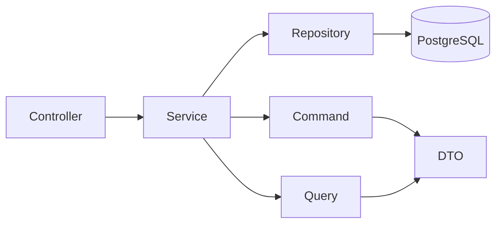
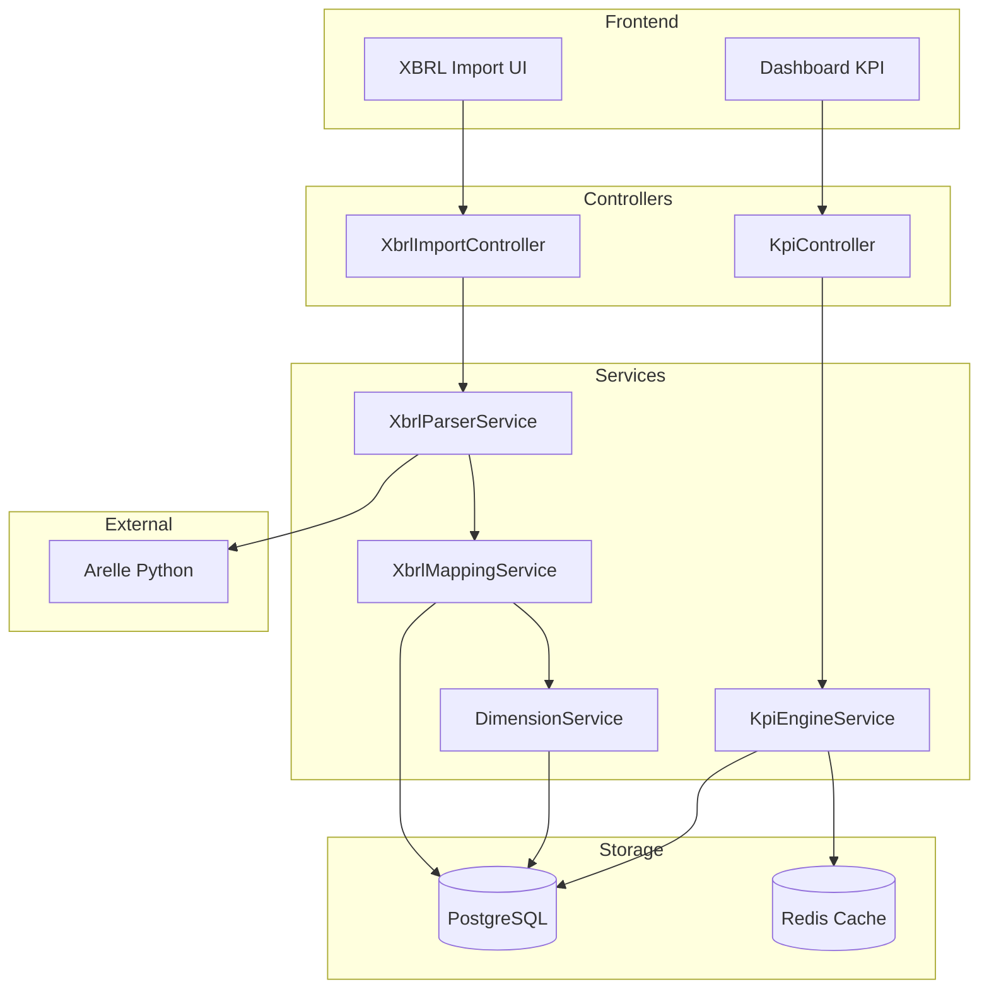
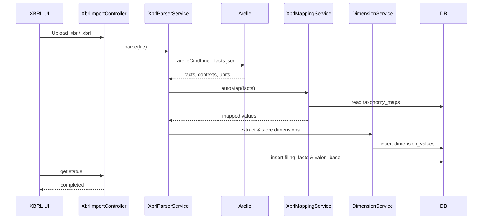

# Architettura — CorpVitals24

Questa guida definisce i pattern architetturali adottati: layering chiaro, CQRS‑lite, iniezione dipendenze, e organizzazione per dominio per mantenibilità e testabilità.

## Indice
- Principi e obiettivi
- Layering e responsabilità
- CQRS‑lite (Command/Query + DTO)
- Iniezione dipendenze (Service Container)
- Eventi, Coda e idempotenza
- Linee guida per moduli (Import, KPI, Report)
- Diagrammi di riferimento

---

## Principi
- Controller sottili, Services a singola responsabilità, Repositories incapsulano accesso dati.
- Dipendenze invertite: il dominio non conosce dettagli infrastrutturali.
- Validazione ai confini (FormRequest; DTO validati) e side‑effects espliciti.
- Letture e scritture separate (CQRS‑lite) quando utile alla chiarezza/perf.

## Layering
- Presentation: Controller (HTTP/Inertia/API), Middleware, Requests.
- Application: Services (use‑case), Commands/Queries, DTO.
- Domain: Models/Regole di dominio (eventuali Value Objects), Policies.
- Infrastructure: Repositories (DB), integrazioni (file, code gen, export), cache.



## CQRS‑lite
- Command: operazioni di scrittura con effetti persistenti (es. `ImportCsvCommand`).
- Query: richieste di lettura ottimizzate per vista (es. `FetchKpiMetricsQuery`).
- DTO: payload tipizzati, niente array non tipizzati.

Esempi:
```php
// app/DTO/ImportCsvCommand.php
final class ImportCsvCommand {
  public function __construct(
    public readonly int $companyId,
    public readonly int $periodId,
    public readonly string $path,
  ) {}
}

// app/DTO/FetchKpiMetricsQuery.php
final class FetchKpiMetricsQuery {
  public function __construct(
    public readonly int $companyId,
    public readonly int $periodId,
    /** @var string[] */ public readonly array $kpiCodes = [],
  ) {}
}
```

## Iniezione dipendenze
Registrare le implementazioni nel container:
```php
// app/Providers/AppServiceProvider.php (register)
$this->app->bind(\App\Services\KpiServiceInterface::class, \App\Services\KpiService::class);
$this->app->bind(\App\Repositories\KpiRepositoryInterface::class, \App\Repositories\KpiRepository::class);
```

Uso nei controller:
```php
// app/Http/Controllers/KpiController.php (estratto)
public function __construct(private KpiServiceInterface $service) {}
```

## Eventi, coda e idempotenza
- Import e calcolo KPI dovrebbero essere eseguiti come Job in coda (code‑offload) con retry e backoff.
- Idempotenza: usare chiavi deterministiche per evitare duplicati (es. `import:{companyId}:{hash}`).
- Pubblicare eventi di dominio per audit/aggiornamento snapshot/MV.

Esempio Job:
```php
// app/Jobs/ProcessImport.php
class ProcessImport implements ShouldQueue {
  use Dispatchable, InteractsWithQueue, Queueable, SerializesModels;
  public function __construct(public ImportCsvCommand $command) {}
  public function handle(ImportService $service): void { $service->handle($this->command); }
}
```

## Linee guida per moduli
- Import: validazione file, parsing, mapping profili, tracciabilità (provenienza). Persistenza transazionale.
- KPI: engine puro, funzioni deterministiche; caching snapshot; audit formule.
- Report: generazione asincrona (Browsershot), storage sicuro, link firmati a scadenza.

## Anti‑pattern da evitare
- Controller con logica SQL diretta o query ad‑hoc ripetute.
- Services con molte responsabilità (feature non correlate nello stesso service).
- DTO opzionali non validati: validare sempre i payload.

## Estensioni future
- Plugin per tassonomie XBRL nazionali, registrati via ServiceProvider.
- Strategia di MV refresh pianificata (cron/queue) con invalidazione cache granulare.

---

## Integrazione XBRL/iXBRL (ESEF + OIC)

Questa sezione documenta l'architettura estesa per supportare l'import dei bilanci in formato **XBRL/iXBRL**.

### Componenti principali
- Parser: **Arelle (Python)** invocato via subprocess o Web Server.
- Services: `XbrlParserService`, `XbrlMappingService`, `DimensionService`.
- Repositories: `XbrlRepository`, `TaxonomyRepository`.
- Storage: Tabelle `filings`, `filing_facts`, `taxonomies`, `taxonomy_maps`, `dimension_defs`, `dimension_values`.
- Cache: Redis per tassonomie e mapping.

### Diagramma componenti



### Pipeline di import XBRL



### Note progettuali
- Auto‑mapping tramite `taxonomy_maps` con regole di segno e moltiplicatore.
- Dimensioni: JSONB su `filing_facts` + tabella `dimension_values` per query mirate.
- Tracciabilità: `valori_base.provenance` collega `filing_fact_id` → KPI.
- Caching tassonomie/mapping in Redis con TTL 24h e invalidazione su update.

