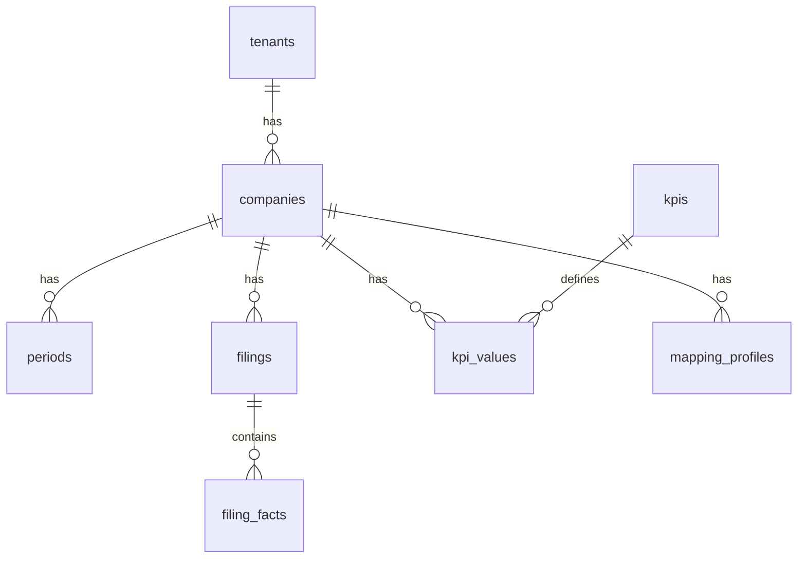

# Database Design — CorpVitals24 (PostgreSQL 16)

Schema pensato per analisi KPI multi‑azienda: normalizzazione, performance con indici e viste materializzate, tracciabilità di provenienza.

## Indice
- Convenzioni e tipi
- ER Diagram (Mermaid)
- Tabelle principali
- Migrazioni esempio
- Relazioni Eloquent
- Multi‑tenant & sicurezza
- Indici, partizionamento, MV

---

## Convenzioni e tipi
- snake_case per tabelle/colonne; chiave `id` BIGSERIAL.
- Valute: `NUMERIC(18,2)`; percentuali/rapporti: `NUMERIC(18,6)`; timestamp `timestamptz`.
- JSONB per metadati/mapping.

## ER Diagram


## Tabelle principali (concettuale)
- `tenants(id, name, plan, settings_json)`
- `companies(id, tenant_id, name, sector, base_currency, fiscal_year_start)`
- `periods(id, company_id, kind, start, "end", currency)`
- `filings(id, company_id, type, file_path, hash, taxonomy_id, original_currency, created_by)`
- `filing_facts(id, filing_id, concept_qname, context_ref, unit_ref, decimals, raw_value, norm_value, note)`
- `taxonomies(id, name, version, country, base, schema_url)`
- `taxonomy_maps(id, taxonomy_id, concept_qname, target_base_value, sign_rule, multiplier, note)`
- `base_values(id, period_id, voice, amount, source, provenance_filing_id)`
- `kpis(id, code, name, description, formula_refs jsonb)`
- `kpi_values(id, period_id, kpi_id, value, unit, state, provenance_json)`
- `mapping_profiles(id, company_id, rules_columns jsonb, rules_xbrl jsonb, created_by)`

## Migrazioni esempio
```php
// database/migrations/2025_01_01_000001_create_companies_table.php
return new class extends Migration {
  public function up() {
    Schema::create('companies', function (Blueprint $t) {
      $t->id();
      $t->foreignId('tenant_id')->constrained()->cascadeOnDelete();
      $t->string('name');
      $t->string('sector')->nullable();
      $t->char('base_currency', 3)->default('EUR');
      $t->unsignedTinyInteger('fiscal_year_start')->default(1); // mese 1..12
      $t->timestamps();
      $t->index(['tenant_id','name']);
    });
  }
  public function down() { Schema::dropIfExists('companies'); }
};
```

```php
// database/migrations/2025_01_01_000010_create_kpi_values_table.php
return new class extends Migration {
  public function up() {
    Schema::create('kpi_values', function (Blueprint $t) {
      $t->id();
      $t->foreignId('period_id')->constrained()->cascadeOnDelete();
      $t->foreignId('kpi_id')->constrained()->cascadeOnDelete();
      $t->decimal('value', 18, 6)->nullable();
      $t->string('unit', 8)->default('%');
      $t->string('state', 12)->nullable(); // traffic light
      $t->jsonb('provenance_json')->nullable();
      $t->timestamps();
      $t->unique(['period_id','kpi_id']);
      $t->index(['kpi_id']);
    });
  }
  public function down() { Schema::dropIfExists('kpi_values'); }
};
```

## Relazioni Eloquent (estratto)
```php
// app/Models/Company.php
class Company extends Model {
  public function tenant() { return $this->belongsTo(Tenant::class); }
  public function periods() { return $this->hasMany(Period::class); }
}

// app/Models/Kpi.php
class Kpi extends Model {
  protected $casts = ['formula_refs' => 'array'];
  public function values() { return $this->hasMany(KpiValue::class); }
}

// app/Models/KpiValue.php
class KpiValue extends Model {
  protected $casts = ['provenance_json' => 'array'];
  public function kpi() { return $this->belongsTo(Kpi::class); }
  public function period() { return $this->belongsTo(Period::class); }
}
```

## Multi‑tenant & sicurezza
- `tenant_id` su entità radice (companies, users‑companies pivot); propagazione per join.
- Opzionale RLS Postgres per isolamento per tenant.
- Policies Laravel per accesso per azienda/tenant.

## Indici, partizionamento, viste materializzate
- Indici composti: `kpi_values(period_id, kpi_id)` e `periods(company_id, start)`.
- JSONB GIN su campi di metadati usati in filtro.
- Partizionamento per anno fiscale su `kpi_values` o `filing_facts` per dataset molto grandi.
- Visite materializzate per snapshot KPI:
```sql
CREATE MATERIALIZED VIEW kpi_snapshot AS
SELECT p.company_id, p.id as period_id, kv.kpi_id, kv.value
FROM periods p
JOIN kpi_values kv ON kv.period_id = p.id;
CREATE INDEX ON kpi_snapshot(company_id, period_id, kpi_id);
```

Refresh strategico:
```sql
REFRESH MATERIALIZED VIEW CONCURRENTLY kpi_snapshot;
```

Best practice:
- Usare `EXPLAIN ANALYZE` per tuning query critiche.
- Evitare JSONB come sostituto del modello relazionale; usarlo per metadati.

