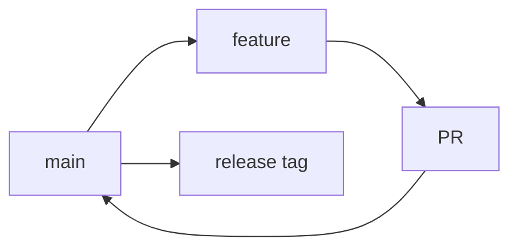

# Development Workflow — CorpVitals24

Processo di sviluppo standardizzato per qualità, velocità e sicurezza.

## Indice
- Branching model
- Pull Request & review
- Pre-commit hooks
- CI/CD (GitHub Actions)
- Releasi e tagging

---

## Branching model
- Base: GitHub Flow con feature branches.
- Nomi branch: `feat/<breve-descrizione>`, `fix/...`, `docs/...`.
- Commits: Conventional Commits.



## Pull Request & review
- PR piccole, descrizione chiara, checklist inclusa.
- Blocchi: almeno 1 approval, status checks verdi, niente commit diretti su `main`.
- Template PR (estratto):
```
## Scopo
- 

## Cambiamenti principali
- 

## Note di test
- 

## Checklist
- [ ] Lint ok
- [ ] Test ok
- [ ] Documentazione aggiornata
```

## Pre-commit hooks
- Husky + lint-staged: `npm run lint` (TS/Vue) e `composer lint` (PHP).

`package.json` (estratto):
```json
{
  "scripts": { "prepare": "husky install" },
  "devDependencies": { "husky": "^9.0.0", "lint-staged": "^15.0.0" },
  "lint-staged": {
    "*.{ts,vue,js}": ["eslint --fix"],
    "*.{php}": ["php vendor/bin/php-cs-fixer fix --dry-run --diff"]
  }
}
```

Hook pre-commit:
```
# .husky/pre-commit
npx lint-staged
```

## CI/CD — GitHub Actions
- Jobs: setup, cache, install deps, lint, test, build, security audit, docker build on tag.

`.github/workflows/ci.yml` (bozza):
```yaml
name: CI
on:
  push:
    branches: [ main ]
  pull_request:
    branches: [ main ]
jobs:
  build:
    runs-on: ubuntu-latest
    steps:
      - uses: actions/checkout@v4
      - name: Setup PHP
        uses: shivammathur/setup-php@v2
        with:
          php-version: '8.3'
          tools: composer
      - name: Setup Node
        uses: actions/setup-node@v4
        with:
          node-version: '20'
          cache: 'npm'
      - name: Cache Composer
        uses: actions/cache@v4
        with:
          path: vendor
          key: ${{ runner.os }}-composer-${{ hashFiles('**/composer.lock') }}
      - name: Install PHP deps
        run: composer install --prefer-dist --no-ansi --no-interaction --no-progress
      - name: Install Node deps
        run: npm ci
      - name: Lint PHP
        run: composer lint
      - name: Lint JS/TS
        run: npm run lint
      - name: Tests PHP
        run: composer test
      - name: Typecheck
        run: npm run typecheck
      - name: Build SPA
        run: npm run build
      - name: Security audit PHP
        run: composer audit || true
      - name: Security audit npm
        run: npm audit --audit-level=high || true
      - name: Build Docker (on tag)
        if: startsWith(github.ref, 'refs/tags/')
        run: |
          docker build -f docker/php-fpm/Dockerfile -t ghcr.io/org/corpvitals24-php:$GITHUB_REF_NAME .
          docker build -f docker/nginx/Dockerfile -t ghcr.io/org/corpvitals24-nginx:$GITHUB_REF_NAME .
```

## Rilasci e tagging
- Versioning SemVer: `vMAJOR.MINOR.PATCH`.
- Release notes: changelog sintetico (feat/fix/breaking) e checklist di deploy.
- Pubblicazione immagini Docker su tag.

