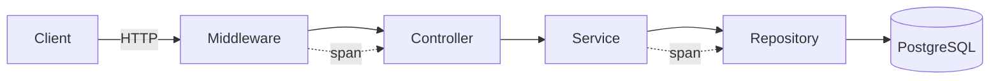

# Observability — CorpVitals24

Linee guida per logging strutturato, metriche, tracing e health check.

## Indice
- Logging (JSON, correlazione)
- Metriche (Prometheus/Grafana)
- Tracing (OpenTelemetry)
- Health checks
- Docker compose (stack osservabilità)
- Test e fallback

---

## Logging
- Formato JSON via Monolog con `JsonFormatter`.
- Context standard: `request_id`, `user_id`, `company_id`, `tenant_id`.
- Rotazione giornaliera e retention configurata.

Config canale:
```php
// config/logging.php (estratto)
'channels' => [
  'json' => [
    'driver' => 'monolog',
    'handler' => Monolog\\Handler\\StreamHandler::class,
    'with' => ['stream' => storage_path('logs/laravel.json')],
    'formatter' => Monolog\\Formatter\\JsonFormatter::class,
  ],
]
```

Middleware `RequestId` per correlazione:
```php
// app/Http/Middleware/RequestId.php (estratto)
$id = $request->headers->get('X-Request-Id') ?? (string) Str::uuid();
Log::withContext(['request_id' => $id]);
$response = $next($request);
$response->headers->set('X-Request-Id', $id);
return $response;
```

---

## Metriche (Prometheus)
- Exporter Laravel (es. `arkaitzgarro/laravel-prometheus-exporter` o simili) per esporre `/metrics`.
- Metriche consigliate: latency per rotta, error rate per codice HTTP, query DB per minuto, job queue.

Esempio registrazione metrica custom:
```php
// app/Providers/AppServiceProvider.php (boot)
$registry = app(\Prometheus\CollectorRegistry::class);
$hist = $registry->getOrRegisterHistogram('corpvitals', 'http_request_duration_seconds', 'HTTP latency', ['route']);
// misurare in middleware e osservare per route name
```

Grafana: dashboard con percentili 50/90/99, throughput, errori, saturazione DB/Redis.

---

## Tracing (OpenTelemetry)
- Strumentare HTTP, DB e job queue con SDK OpenTelemetry PHP.
- Esportare verso OTLP collector (tempo reale) o Jaeger/Tempo.

Schema flusso:


---

## Health checks
- Endpoint `/health` JSON con esito DB/Cache/Queue.

Esempio:
```php
// routes/api.php
Route::get('/health', function () {
  try { DB::select('select 1'); $db = true; } catch (Throwable $e) { $db = false; }
  $redis = Cache::store('redis')->set('ping', '1', 1);
  return response()->json(['ok' => $db && $redis, 'db' => $db, 'cache' => (bool)$redis], 200);
});
```

---

## Docker compose (osservabilità)
```
services:
  prometheus:
    image: prom/prometheus
    volumes:
      - ./docker/observability/prometheus.yml:/etc/prometheus/prometheus.yml
    ports: ["9090:9090"]
  grafana:
    image: grafana/grafana
    ports: ["3000:3000"]
    depends_on: [prometheus]
  otel-collector:
    image: otel/opentelemetry-collector:latest
    ports: ["4317:4317"]
    volumes:
      - ./docker/observability/otel-collector.yaml:/etc/otelcol/config.yaml
```

Prometheus scrape (esempio):
```
scrape_configs:
  - job_name: 'corpvitals'
    static_configs:
      - targets: ['app:80']
```

---

## Test e fallback
- Testare `/health` in CI; simulare errore DB e verificare `ok=false`.
- Se formato JSON logging fallisce, fallback a text formatter e generare warning.
