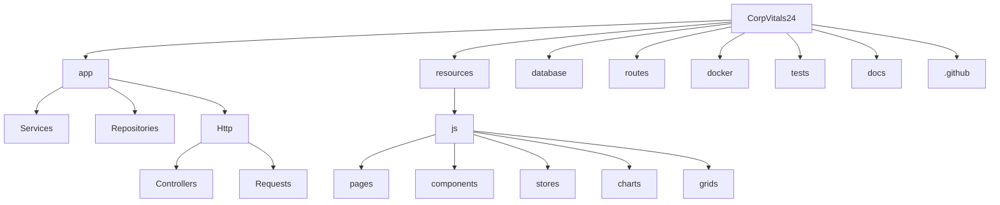

# Struttura di Progetto — CorpVitals24

Questa struttura organizza il codice per dominio e responsabilità, facilitando testabilità, sicurezza e performance.

```
CorpVitals24/
  app/
    DTO/
    Services/
    Repositories/
    Models/
    Http/
      Controllers/
      Middleware/
      Requests/
    Policies/
    Providers/
  bootstrap/
  config/
  database/
    migrations/
    seeders/
    factories/
  resources/
    js/
      pages/
      components/
      stores/
      i18n/
      charts/
      grids/
      composables/
      utils/
    css/
    views/
  routes/
    api.php
    web.php
  public/
  storage/
  tests/
    Unit/
    Feature/
  docker/
    php-fpm/
    nginx/
    docker-compose.yml
  .github/
    workflows/
  docs/
    analisi-funzionale.md
    STACK_VERSIONS.md
    PROJECT_STRUCTURE.md
    registro-attivita.md
    todo.md
  scripts/
```

## Spiegazione directory principali

- `app/`: codice dominio Laravel. Tenere i Controller sottili e spostare logica in `Services/`. `Repositories/` isolano l'accesso dati e le query Postgres ottimizzate. `DTO/` definisce i payload tipizzati per comandi e query. `Policies/` e `Providers/` registrano autorizzazioni e binding DI.
- `database/`: migrazioni atomiche, seeders per dati di test, factories per test rapidi. Usare indici e tipi NUMERIC per valori finanziari.
- `resources/js/`: SPA Inertia Vue 3 TS. `pages/` per route-level views; `components/` per UI riutilizzabili; `stores/` Pinia; `i18n/` per localizzazione; `charts/` (ECharts) e `grids/` (RevoGrid) con import dinamico; `composables/` per logica condivisa; `utils/` helper.
- `routes/`: `api.php` (REST v1 con `auth:sanctum` + throttle), `web.php` (Inertia routes, middleware CSRF).
- `docker/`: definizioni servizi (php-fpm, nginx, postgres, redis). Versionare le config.
- `tests/`: unit/feature; opzionale e2e SPA (Cypress) fuori repo backend se necessario.
- `docs/`: documentazione tecnica allineata alla CI; include registro attività e TODO.

## Relazioni tra layer (Mermaid)



## Convenzioni aggiuntive

- Alias Vite: `@` → `resources/js` per import puliti.
- Nomenclatura file: SFC Vue in PascalCase; store Pinia con suffisso `Store`.
- Evitare logica di business in `pages/`; spostarla in `composables/` o Services via endpoint.
- Accessibilità: componenti Headless UI e focus management nelle griglie/grafici.
